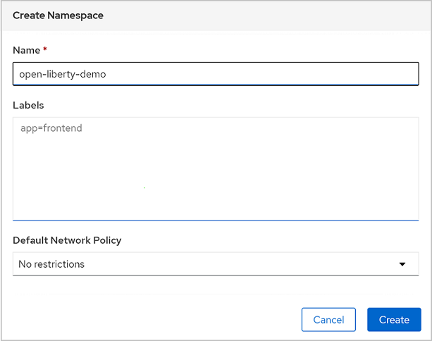
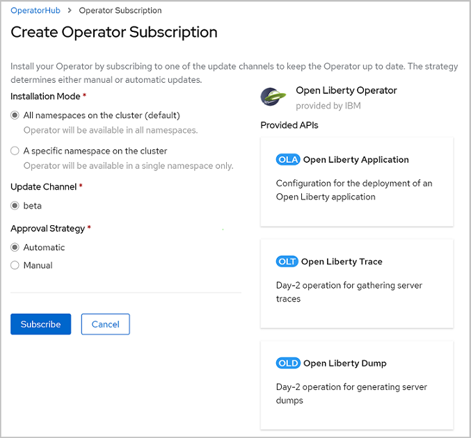
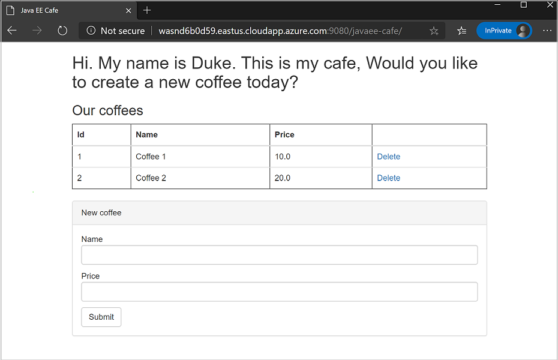
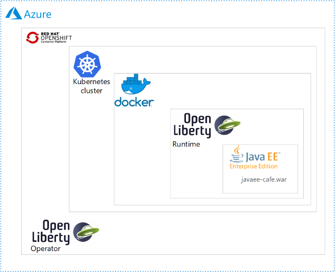

# Deploy a Java application with Open Liberty/WebSphere Liberty on an Azure Red Hat OpenShift 4 cluster

This guide demonstrates how to run your Jakarta EE, [Jakarta EE](https://jakarta.ee/), or [MicroProfile](https://microprofile.io/) application on the Open Liberty/WebSphere Liberty runtime and then deploy the containerized application to an Azure Red Hat OpenShift (ARO) 4 cluster using the Open Liberty Operator. This article will walk you through preparing a Liberty application, building the application Docker image and running the containerized application on an ARO 4 cluster.  The foundational elements of technology in this article include the following:

* [Open Liberty](https://openliberty.io): Open Liberty is an IBM Open Source project that implements the Eclipse MicroProfile specifications and is also Jakarta EE compatible. Open Liberty is fast to start up with a low memory footprint and supports live reloading for quick iterative development. It is simple to add and remove features from the latest versions of MicroProfile and Jakarta EE. Zero migration lets you focus on what's important, not the APIs changing under you.
* [WebSphere Liberty](https://www.ibm.com/cloud/websphere-liberty): IBM WebSphere Liberty architecture shares the same code base as the open sourced Open Liberty server runtime, which provides additional benefits such as low-cost experimentation, customization and seamless migration from open source to production.
* [Azure Red Hat OpenShift](https://azure.microsoft.com/services/openshift/): Azure Red Hat OpenShift provides flexible, self-service deployment of fully managed OpenShift clusters. Maintain regulatory compliance and focus on your application development, while your master, infrastructure, and application nodes are patched, updated, and monitored by both Microsoft and Red Hat.

## Prerequisites

Complete the following prerequisites to successfully walk through this guide.

<!-- IMPORTANT: find a way to capture this activation action to count against our OKRs.  DO NOT PUBLISH without this. -->
1. [Register an Azure subscription](https://azure.microsoft.com/pricing/purchase-options/pay-as-you-go/).
   > [!NOTE]
   > Azure Red Hat OpenShift requires a minimum of 40 cores to create and run an OpenShift cluster. The default Azure resource quota for a new Azure subscription does not meet this requirement. To request an increase in your resource limit, see [Standard quota: Increase limits by VM series](https://docs.microsoft.com/azure/azure-portal/supportability/per-vm-quota-requests). Note that the free trial subscription isn't eligible for a quota increase, [upgrade to a Pay-As-You-Go subscription](https://docs.microsoft.com/azure/cost-management-billing/manage/upgrade-azure-subscription) before requesting a quota increase.
2. Prepare a local machine with Unix-like operating system installed (for example, Ubuntu, macOS).
3. Install a Java SE implementation (for example, [AdoptOpenJDK OpenJDK 8 LTS/OpenJ9](https://adoptopenjdk.net/?variant=openjdk8&jvmVariant=openj9)).
4. Install [Maven](https://maven.apache.org/download.cgi) 3.5.0 or higher.
5. Install [Docker](https://docs.docker.com/get-docker/) for your OS.
6. Install [Azure CLI](https://docs.microsoft.com/cli/azure/install-azure-cli?view=azure-cli-latest&preserve-view=true) 2.0.75 or later.
7. Check and install [`envsubst`](https://command-not-found.com/envsubst) if it's not pre-installed in your operating system.
8. Clone [this repository](https://github.com/Azure-Samples/open-liberty-on-aro) to your local file system.

### Set up Azure Red Hat OpenShift cluster

Follow the instructions in these two tutorials and then return here to continue.

1. Create the cluster by following the steps in [Create an Azure Red Hat OpenShift 4 cluster](https://learn.microsoft.com/en-us/azure/openshift/tutorial-create-cluster).
   > [!NOTE]
   > Though the "Get a Red Hat pull secret" step is labeled as optional, **it is required for this article**.  The pull secret enables your Azure Red Hat OpenShift cluster to find the Open Liberty Operator.
   >
   > If you plan to run memory-intensive applications on the cluster, specify the proper virtual machine size for the worker nodes using the `--worker-vm-size` parameter. For example, `Standard_E4s_v3` is the minimum virtual machine size to install the Elasticsearch Operator on a cluster. Refer to the following for further details:
   >
   > * [Azure CLI to create a cluster](https://docs.microsoft.com/cli/azure/aro?view=azure-cli-latest&preserve-view=true#az-aro-create)
   > * [Supported virtual machine sizes for memory optimized](/azure/openshift/support-policies-v4#memory-optimized)
   > * [Prerequisites to install the Elasticsearch Operator](https://docs.openshift.com/container-platform/4.3/logging/cluster-logging-deploying.html#cluster-logging-deploy-eo-cli_cluster-logging-deploying)

2. Connect to the cluster by following the steps in [Connect to an Azure Red Hat OpenShift 4 cluster](/azure/openshift/tutorial-connect-cluster).
   > [!NOTE]
   >
   > * Be sure to follow the steps in "Install the OpenShift CLI" because we will use the `oc` command later in this article.
   > * Write down the cluster console URL which looks like `https://console-openshift-console.apps.<random>.<region>.aroapp.io/`.
   > * Write down the `kubeadmin` credentials.

Then verify you can log in to the OpenShift CLI with the token for user `kubeadmin`.

#### Log in to the OpenShift CLI with the token

Before executing the following steps, be sure to log in to the OpenShift web console from your browser.

1. At the right-top of the web console, expand the context menu of the logged-in user, then select "Copy Login Command".
2. Log in to a new tab window with the same user if necessary.
3. Select "Display Token".
4. Copy the value listed below "Log in with this token" to the clipboard and run it in a shell, as shown here.

   ```bash
   oc login --token=XOdASlzeT7BHT0JZW6Fd4dl5EwHpeBlN27TAdWHseob --server=https://api.aqlm62xm.rnfghf.aroapp.io:6443
   Logged into "https://api.aqlm62xm.rnfghf.aroapp.io:6443" as "kube:admin" using the token provided.

   You have access to 57 projects, the list has been suppressed. You can list all projects with 'oc projects'

   Using project "default".
   ```

### Set up Azure Active Directory

Azure Active Directory (Azure AD) implements OpenID Connect (OIDC), an authentication protocol built on OAuth 2.0, which lets you securely sign in a user from Azure AD to the ARO 4 cluster. Follow the steps below to set up your Azure AD.

1. [Get an Azure AD tenant](https://docs.microsoft.com/azure/active-directory/develop/quickstart-create-new-tenant). It is very likely your Azure account already has a tenant. Write down your **tenant ID**.
2. [Create a few Azure AD users](https://docs.microsoft.com/azure/active-directory/fundamentals/add-users-azure-active-directory). You can use these accounts or your own to test the application. Write down email addresses and passwords for login.
3. [Create a new application registration](https://docs.microsoft.com/azure/active-directory/develop/quickstart-register-app) in your Azure AD tenant. Specify **Redirect URI** to be `https://oauth-openshift.apps.<random>.<region>.aroapp.io/oauth2callback/openid`. The value of **\<random>** and **\<region>** is same as the one from the cluster console URL. Write down the **client ID**.
4. Create a new client secret. In the newly created application registration, select **Certificates & secrets** > Select **New client secret** > Provide **a description** and hit **Add**. Write down the generated **client secret** value.

### Add OpenID Connect identity provider

To access the built-in container image registry provided by the ARO 4 cluster, an identity provider (IDP) needs to be configured using Azure Active Directory OpenID Connect.

1. Log in to the OpenShift web console from your browser using the `kubeadmin` credentials.
2. Open **Administration** > **Cluster Settings** > **Global Configuration** > **OAuth** > **Identity Providers** > **Add** > **OpenID Connect**.
3. Specify **Client ID** and **Client Secret** as the ones you wrote down before. Specify **Name** as **openid**.
4. Replace **\<tenant-id>** with the one you wrote down before for the URL `https://login.microsoftonline.com/<tenant-id>/v2.0/.well-known/openid-configuration` > Open the URL in your browser > Copy the value of property **issuer** in the returned JSON body and paste it to textbox **Issuer URL**.
5. Select **Add**.

### Access the built-in container image registry

OpenShift Container Platform provides a built-in container image registry which runs as a standard workload on the ARO 4 cluster. The registry provides an out of the box solution for users to manage the images that run their workloads, and runs on top of the existing cluster infrastructure. Follow the instructions below to enable the access of the built-in registry.

1. Log in to the OpenShift web console from your browser using the credentials of an Azure AD user.
   > [!NOTE]
   > Write down the user name and password for this Azure AD user, as it will be used as **the administrator** for the demo project throughout this guide and subsequent ones.
2. [Log in to the OpenShift CLI with the token for this Azure AD user](#log-in-to-the-openshift-cli-with-the-token).
3. Run `oc whoami` in the console and write down its output as **\<aad-user>**.
4. Log in to the OpenShift web console from your browser using the `kubeadmin` credentials.
5. [Log in to the OpenShift CLI with the token for `kubeadmin`](#log-in-to-the-openshift-cli-with-the-token).
6. Execute the following commands to enable the access to the built-in registry for the **aad-user**.

   ```bash
   # Switch to project "openshift-image-registry"
   oc project openshift-image-registry

   # Expose the registry using "DefaultRoute"
   oc patch configs.imageregistry.operator.openshift.io/cluster --patch '{"spec":{"defaultRoute":true}}' --type=merge

   # Note: write down the value of "Container Registry URL" in the output, which is the fully qualified registry name
   HOST=$(oc get route default-route --template='{{ .spec.host }}')
   echo "Container Registry URL: $HOST"

   # Add roles to "aad-user" for pulling and pushing images
   # Note: replace "<aad-user>" with the one you wrote down before
   oc policy add-role-to-user registry-viewer <aad-user>
   oc policy add-role-to-user registry-editor <aad-user>
   ```

   > [!NOTE]
   > Write down the console output of **Container Registry URL**. It will be used as the fully qualified registry name for this guide and subsequent ones.

### Create an administrator for the demo project

Besides image management, the **aad-user** will also be granted administrative permissions for managing resources in the demo project of the ARO 4 cluster.

1. Log in to the OpenShift web console from your browser using the `kubeadmin` credentials.
2. Navigate to **Administration** > **Namespaces** > **Create Namespace**.
3. Fill in "open-liberty-demo" for **Name** and select **Create**, as shown next.

   

4. [Log in to the OpenShift CLI with the token for `kubeadmin`](#log-in-to-the-openshift-cli-with-the-token).
5. Execute the following commands to grant `admin` role to the **aad-user** in namespace `open-liberty-demo`.

   ```bash
   # Switch to project "open-liberty-demo"
   oc project open-liberty-demo

   # Note: replace "<aad-user>" with the one you wrote down before
   oc adm policy add-role-to-user admin <aad-user>
   ```

### Install the Open Liberty OpenShift Operator

After creating and connecting to the cluster, install the [Open Liberty Operator](https://github.com/OpenLiberty/open-liberty-operator).

1. Log in to the OpenShift web console from your browser using the `kubeadmin` credentials.
2. Navigate to **Operators** > **OperatorHub** and search for **Open Liberty Operator**.
3. Select **Open Liberty Operator** from the search results.
4. Select **Install**.
5. In the popup **Create Operator Subscription**, check **All namespaces on the cluster (default)** for **Installation Mode**, **beta** for **Update Channel**, and **Automatic** for **Approval Strategy**:

   
6. Select **Subscribe** and wait a minute or two until the Open Liberty Operator is displayed.
7. Observe the Open Liberty Operator with status of "Succeeded".  If you do not, trouble shoot and resolve the problem before continuing.

## Prepare the Liberty application

We will use a Jakarta EE 10 application as our example in this guide. Open Liberty is a [Jakarta EE 10 full profile](https://javaee.github.io/javaee-spec/javadocs/) compatible server, so it can easily run the application.  Open Liberty is also [Jakarta EE 10 full profile compatible](https://jakarta.ee/specifications/platform/8/apidocs/).  If you already have a Jakarta EE or MicroProfile application running on an existing server (for example, IBM WebSphere Application Server, Oracle WebLogic Server, WildFly, JBoss EAP, and so on), only minimal changes should be necessary to make the application run on Liberty runtime.

### Sample application

Within the git repo you cloned in the Prerequisites section, change directory to `1-start`. The sample application uses Maven at build time and only Jakarta EE 10 APIs (Jakarta REST, EJB, CDI, JSON-B, Faces, Bean Validation) at runtime. This standard Jakarta EE app will be used as a starting point to demonstrate the ease of migration to the Liberty runtime. Here is the project structure:

```Text
├── pom.xml                                         # Maven POM file
└── src
    └── main
        ├── java
        │   └── cafe
        │       ├── model
        │       │   ├── CafeRepository.java         # Cafe CRUD repository (in-memory)
        │       │   └── entity
        │       │       └── Coffee.java             # Coffee entity
        │       └── web
        │           ├── rest
        │           │   └── CafeResource.java       # Cafe CRUD REST APIs
        │           └── view
        │               └── Cafe.java               # Cafe bean in JSF client
        ├── resources
        │   ├── META-INF
        │   └── cafe
        │       └── web
        │           ├── messages.properties         # Resource bundle in EN
        │           └── messages_es.properties      # Resource bundle in ES
        └── webapp
            ├── WEB-INF
            │   ├── faces-config.xml                # JSF configuration file specifying resource bundles and supported locales
            │   └── web.xml                         # Deployment descriptor for a Servlet-based Java web application
            └── index.xhtml                         # Home page for JSF client
```

### Run the application on Open Liberty

To run the application on Open Liberty, you need to create an Open Liberty server configuration file so that the [Liberty Maven plugin](https://github.com/OpenLiberty/ci.maven#liberty-maven-plugin) can package the application for deployment. The Liberty Maven plugin is not required to deploy the application to OpenShift but we will use it in this example with Open Liberty’s developer (dev) mode to easily run the application locally. Complete the following steps on your local computer:

1. Copy `2-simple/src/main/liberty/config/server.xml` to `1-start/src/main/liberty/config`, overwriting the existing zero-length file. This `server.xml` configures the Open Liberty server with Jakarta EE features.
2. Replace `1-start/pom.xml` with `2-simple/pom.xml` to add the `liberty-maven-plugin` to the pom.
3. Change directory to `1-start` of your local clone.
4. Run `mvn clean package` in a console to generate a war package `javaee-cafe.war` in the directory `./target`.
5. Run `mvn liberty:dev` to start Open Liberty in dev mode.
6. Wait until the server starts. You’ll see the following output in your console:

   ```Text
   [INFO] Listening for transport dt_socket at address: 7777
   [INFO] Launching defaultServer (Open Liberty 20.0.0.6/wlp-1.0.41.cl200620200528-0414) on Java HotSpot(TM) 64-Bit Server VM, version 1.8.0_251-b08 (en_US)
   [INFO] [AUDIT   ] CWWKE0001I: The server defaultServer has been launched.
   [INFO] [AUDIT   ] CWWKG0093A: Processing configuration drop-ins resource:
   [INFO]   Property location will be set to ${server.config.dir}/apps/javaee-cafe.war.
   [INFO]
   [INFO] [AUDIT   ] CWWKZ0058I: Monitoring dropins for applications.
   [INFO] [AUDIT   ] CWWKT0016I: Web application available (default_host): http://localhost:9080/
   [INFO] [AUDIT   ] CWWKZ0001I: Application javaee-cafe started in 3.453 seconds.
   [INFO] [AUDIT   ] CWWKF0012I: The server installed the following features: [cdi-2.0, ejbLite-3.2, el-3.0, jaxb-2.2, jaxrs-2.1, jaxrsClient-2.1, jndi-1.0, jsf-2.3, jsonp-1.1, jsp-2.3, servlet-4.0].
   [INFO] [AUDIT   ] CWWKF0011I: The defaultServer server is ready to run a smarter planet. The defaultServer server started in 6.447 seconds.
   [INFO] CWWKM2015I: Match number: 1 is [6/10/20 10:26:09:517 CST] 00000022 com.ibm.ws.kernel.feature.internal.FeatureManager            A CWWKF0011I: The defaultServer server is ready to run a smarter planet. The defaultServer server started in 6.447 seconds..
   [INFO] Press the Enter key to run tests on demand. To stop the server and quit dev mode, use Ctrl-C or type 'q' and press the Enter key.
   [INFO] Source compilation was successful.
   ```

7. Open [http://localhost:9080/](http://localhost:9080/) in your browser to visit the application home page. The application will look similar to the following:

   
8. Press **Control-C** to stop the application and Open Liberty server.

The directory `2-simple` of your local clone shows the Maven project with the above changes already applied.

## Prepare the application image

To deploy and run your Liberty application on an ARO 4 cluster, containerize your application as a Docker image using [Open Liberty container images](https://github.com/OpenLiberty/ci.docker) or [WebSphere Liberty container images](https://github.com/WASdev/ci.docker).

### Build application image

Complete the following steps to build the application image:

1. Change directory to `2-simple` of your local clone.
2. Run `mvn clean package` to package the application.
3. Run one of the following commands to build the application image.
   * Build with Open Liberty base image:

     ```bash
     # Build and tag application image. This will cause Docker to pull the necessary Open Liberty base images.
     docker build -t javaee-cafe-simple:1.0.0 --pull .
     ```

   * Build with WebSphere Liberty base image:

     ```bash
     # Build and tag application image. This will cause Docker to pull the necessary WebSphere Liberty base images.
     docker build -t javaee-cafe-simple:1.0.0 --pull --file=Dockerfile-wlp .
     ```

### Run the application locally with Docker

Before deploying the containerized application to a remote cluster, run with your local Docker to verify whether it works:

1. Run `docker run -it --rm -p 9080:9080 javaee-cafe-simple:1.0.0` in your console.
2. Wait for Liberty server to start and the application to deploy successfully.
3. Open [http://localhost:9080/](http://localhost:9080/) in your browser to visit the application home page.
4. Press **Control-C** to stop the application and Liberty server.

### Push the image to the container image registry

When you're satisfied with the state of the application, push it to the built-in container image registry by following the instructions below:

1. Log in to the OpenShift web console from your browser using the credentials of the Azure AD user.
2. [Log in to the OpenShift CLI with the token for the Azure AD user](#log-in-to-the-openshift-cli-with-the-token).
3. Execute the following commands to push the image:

   ```bash
   # Note: replace "<Container_Registry_URL>" with the fully qualified name of the registry
   Container_Registry_URL=<Container_Registry_URL>

   # Create a new tag with registry info that refers to source image
   docker tag javaee-cafe-simple:1.0.0 ${Container_Registry_URL}/open-liberty-demo/javaee-cafe-simple:1.0.0

   # Log in to the built-in container image registry
   docker login -u $(oc whoami) -p $(oc whoami -t) ${Container_Registry_URL}

   # Push image to the built-in container image registry
   docker push ${Container_Registry_URL}/open-liberty-demo/javaee-cafe-simple:1.0.0
   ```

## Deploy application on the ARO 4 cluster

Now you can deploy the sample Liberty application to the Azure Red Hat OpenShift 4 cluster [you created earlier in the article](#set-up-azure-red-hat-openshift-cluster).

### Deploy the application from GUI

Because we use the Open Liberty Operator to manage Liberty applications, we need to create an instance of its *Custom Resource Definition*, of type "OpenLibertyApplication". The Operator will then take care of all aspects of managing the OpenShift resources required for deployment.

1. Log in to the OpenShift web console from your browser using the credentials of the Azure AD user.
2. Expand **Home**, Select **Projects** > **open-liberty-demo**.
3. Navigate to **Operators** > **Installed Operators** > **Open Liberty Operator** > **Open Liberty Application**.  The navigation of items in the user interface mirrors the actual containment hierarchy of technologies in use.

   
4. Select **Create OpenLibertyApplication**
5. Replace the generated yaml with yours, which is located at `<path-to-repo>/2-simple/openlibertyapplication.yaml`.
6. Select **Create**.
7. You'll be returned to the list of OpenLibertyApplications.  Select **javaee-cafe-simple** > **Resources** > **javaee-cafe-simple (Route)** and select the link below **Location**.

You'll see the application home page opened in the browser.

### Deploy the application from CLI

Instead of using the web console GUI, you can deploy the application from the command-line. If you have not already done so, download and install the `oc` command-line tool by following Red Hat documentation [Getting Started with the CLI](https://docs.openshift.com/container-platform/4.2/cli_reference/openshift_cli/getting-started-cli.html).

1. Log in to the OpenShift web console from your browser using the credentials of the Azure AD user.
2. [Log in to the OpenShift CLI with the token for the Azure AD user](#log-in-to-the-openshift-cli-with-the-token).
3. Change directory to `2-simple` of your local clone, and run the following commands to deploy your Liberty application to the ARO 4 cluster.

   ```bash
   # Switch to namespace "open-liberty-demo" where resources of demo app will belong to
   oc project open-liberty-demo

   Now using project "open-liberty-demo" on server "https://api.aqlm62xm.rnfghf.aroapp.io:6443".

   # Create OpenLibertyApplication "javaee-cafe-simple"
   oc create -f openlibertyapplication.yaml

   openlibertyapplication.openliberty.io/javaee-cafe-simple created

   # Check if OpenLibertyApplication instance is created
   oc get openlibertyapplication javaee-cafe-simple

   NAME                 IMAGE                      EXPOSED   RECONCILED   AGE
   javaee-cafe-simple   javaee-cafe-simple:1.0.0   true      True         36s

   # Check if deployment created by Operator is ready
   oc get deployment javaee-cafe-simple

   NAME                 READY   UP-TO-DATE   AVAILABLE   AGE
   javaee-cafe-simple   1/1     1            0           102s
   ```

4. Check to see `1/1` under the `READY` column before you continue.  If not, investigate and resolve the problem before continuing.
5. Discover the host of route to the application with the `oc get route` command, as shown here.

   ```bash
   # Get host of the route
   HOST=$(oc get route javaee-cafe-simple --template='{{ .spec.host }}')
   echo "Route Host: $HOST"

   Route Host: javaee-cafe-simple-open-liberty-demo.apps.aqlm62xm.rnfghf.aroapp.io
   ```

   Once the Liberty application is up and running, open the output of **Route Host** in your browser to visit the application home page.

## Next steps

In this guide, you learned how to:
> [!div class="checklist"]
>
> * Prepare the Liberty application
> * Build the application image
> * Run the containerized application on an ARO 4 cluster using the GUI and the CLI.

Advance to one of the next guides, which integrate Liberty applications with different Azure services:
> [!div class="nextstepaction"]
> [Integrate your Liberty application with Elasticsearch stack](howto-integrate-elasticsearch-stack.md)

> [!div class="nextstepaction"]
> [Integrate your Liberty application with Azure managed databases](howto-integrate-azure-managed-databases.md)

> [!div class="nextstepaction"]
> [Set up your Liberty application in a multi-node stateless cluster with load balancing](howto-setup-stateless-cluster.md)

> [!div class="nextstepaction"]
> [Integrate your Liberty application with Azure Active Directory OpenID Connect](howto-integrate-aad-oidc.md)

> [!div class="nextstepaction"]
> [Integrate your Liberty application with Azure Active Directory Domain Service via Secure LDAP](howto-integrate-aad-ldap.md)

Here are references used in this guide:

* [Open Liberty](https://openliberty.io/)
* [Azure Red Hat OpenShift](https://azure.microsoft.com/services/openshift/)
* [Open Liberty Operator](https://github.com/OpenLiberty/open-liberty-operator)
* [Open Liberty Server Configuration](https://openliberty.io/docs/ref/config/)
* [Liberty Maven Plugin](https://github.com/OpenLiberty/ci.maven#liberty-maven-plugin)
* [Open Liberty Container Images](https://github.com/OpenLiberty/ci.docker)
* [WebSphere Liberty Container Images](https://github.com/WASdev/ci.docker)
