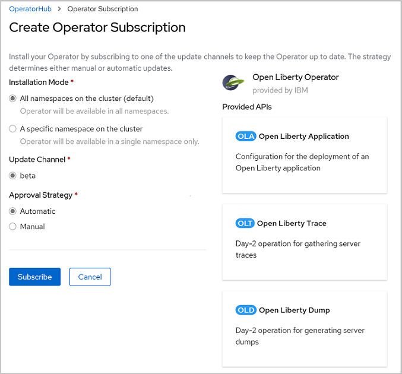
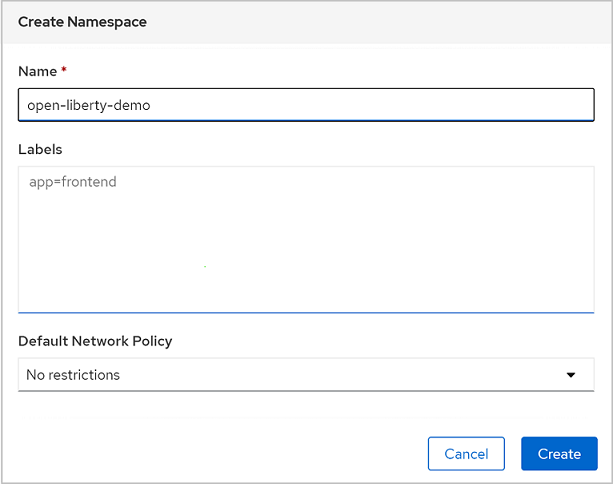

# Deploy a Java application with Open Liberty on an Azure Red Hat OpenShift 4 cluster

This guide demonstrates how to run your Java, Java EE, Jakarta EE or MicroProfile application on the Open Liberty runtime and then deploy the containerized application to an Azure Red Hat OpenShift (ARO) 4 cluster using the Open Liberty Operator. This article will walk you through preparing an Open Liberty application, building the application Docker image and running the containerized application on an ARO 4 cluster.

* [Open Liberty](https://openliberty.io): Open Liberty is an IBM Open Source project that implements the Eclipse MicroProfile specifications and is also Java/Jakarta EE compatible. Open Liberty is fast to start up with a low memory footprint and supports live reloading for quick iterative development. It is simple to add and remove features from the latest versions of MicroProfile and Java/Jakarta EE. Zero migration lets you focus on what's important, not the APIs changing under you.
* [Azure Red Hat OpenShift](https://azure.microsoft.com/services/openshift/): Azure Red Hat OpenShift provides a flexible, self-service deployment of fully managed OpenShift clusters. Maintain regulatory compliance and focus on your application development, while your master, infrastructure, and application nodes are patched, updated, and monitored by both Microsoft and Red Hat.

## Prerequisites

Finish the following prerequisites to successfully walk through this guide.

1. Install a Java SE implementation per your needs (for example, [AdoptOpenJDK OpenJDK 8 LTS/OpenJ9](https://adoptopenjdk.net/?variant=openjdk8&jvmVariant=openj9)).
2. Install [Maven](https://maven.apache.org/download.cgi) 3.5.0 or higher.
3. Install [Docker](https://docs.docker.com/get-docker/) for your OS.
4. Register a [Docker Hub](https://id.docker.com/) account.
5. Install [Azure CLI](https://docs.microsoft.com/cli/azure/install-azure-cli?view=azure-cli-latest) 2.0.75 or later.
6. Register an Azure subscription. If you don't have one, you can get one for free for one year [here](https://azure.microsoft.com/free).
7. Clone [this repository](https://github.com/Azure-Samples/open-liberty-on-aro) to your local file system.

## Set up Azure Red Hat OpenShift cluster

Follow the instructions in these two tutorials and then return here to continue.

1. Create the cluster by following the steps in [Create an Azure Red Hat OpenShift 4 cluster](https://docs.microsoft.com/azure/openshift/tutorial-create-cluster).

   > [!NOTE]
   > If you plan to run memory-intensive applications on the cluster, specify the proper virtual machine size for the worker nodes using the `--worker-vm-size` parameter. For example, `Standard_E4s_v3` is the minimum virtual machine size to install the Elasticsearch Operator on a cluster. Refer to the following for further details:
   > * [Azure CLI to create a cluster](https://docs.microsoft.com/cli/azure/aro?view=azure-cli-latest#az-aro-create)
   > * [Supported virtual machine sizes for memory optimized](https://docs.microsoft.com/azure/openshift/support-policies-v4#memory-optimized)
   > * [Prerequisites to install the Elasticsearch Operator](https://docs.openshift.com/container-platform/4.3/logging/cluster-logging-deploying.html#cluster-logging-deploy-eo-cli_cluster-logging-deploying)

2. Connect to the cluster by following the steps in [Connect to an Azure Red Hat OpenShift 4 cluster](https://docs.microsoft.com/azure/openshift/tutorial-connect-cluster).

After creating and connecting to the cluster, install the [Open Liberty Operator](https://github.com/OpenLiberty/open-liberty-operator).

1. Log in to the OpenShift web console from your browser.
2. Navigate to **Operators** > **OperatorHub** and search for **Open Liberty Operator**.
3. Click **Open Liberty Operator** from the search results.
4. Click **Install**.
   
5. Click **Subscribe** and wait until **Open Liberty Operator** is listed as one of Installed Operators.

## Prepare Open Liberty application

We will use a Java EE 8 application as our example in this guide. Open Liberty is a Java EE 8 full profile compatible server, so it will be able to easily run the application. If you already have a Java EE, Jakarta EE or MicroProfile application running on an existing server (for example, IBM WebSphere Liberty, IBM WebSphere Traditional, Oracle WebLogic Server, WildFly, JBoss EAP, and so on), only minimal changes should be necessary to make the application run on Open Liberty.

### Get a quickstart with a basic Java Application

Change directory to `<path-to-repo>/1-start` of your local clone to see the sample application. It uses Maven and Java EE 8 (JAX-RS, EJB, CDI, JSON-B, JSF, Bean Validation). It will be used as a start point to demonstrate how easily it can be migrated to Open Liberty. Here is the project structure:

```Text
├── pom.xml                                         # Maven POM file
└── src
    └── main
        ├── java
        │   └── cafe
        │       ├── model
        │       │   ├── CafeRepository.java         # Cafe CRUD repository (in-memory)
        │       │   └── entity
        │       │       └── Coffee.java             # Coffee entity
        │       └── web
        │           ├── rest
        │           │   └── CafeResource.java       # Cafe CRUD REST APIs
        │           └── view
        │               └── Cafe.java               # Cafe bean in JSF client
        ├── resources
        │   ├── META-INF
        │   └── cafe
        │       └── web
        │           ├── messages.properties         # Resource bundle in EN
        │           └── messages_es.properties      # Resource bundle in ES
        └── webapp
            ├── WEB-INF
            │   ├── faces-config.xml                # JSF configuration file specifying resource bundles and supported locales
            │   └── web.xml                         # Deployment descriptor for a Servlet-based Java web application
            └── index.xhtml                         # Home page for JSF client
```

### Run the application on Open Liberty

To migrate the application to Open Liberty, you will need to add a `server.xml` file, which configures the necessary features of Open Liberty.
Add this configuration file to `<path-to-repo>/1-start/src/main/liberty/config`. The [liberty-maven-plugin](https://github.com/OpenLiberty/ci.maven#liberty-maven-plugin) looks in this directory when packaging the application for deployment. We will use the plugin as a convenience to easily run the application locally. The plugin need not be included while deploying the application to OpenShift.

The `liberty-maven-plugin` provides a number of goals for managing an Open Liberty server and applications.  We will use dev mode to get a look at the sample application running locally.
Follow steps below to run the application on Open Liberty in your local machine.

1. Add `<path-to-repo>/2-simple/src/main/liberty/config/server.xml` to `<path-to-repo>/1-start/src/main/liberty/config`.
2. Replace `<path-to-repo>/1-start/pom.xml` with `<path-to-repo>/2-simple/pom.xml`.
3. Change directory to `<path-to-repo>/1-start` of your local clone.
4. Run `mvn clean package` in a console.  This will generate a war package `javaee-cafe.war` in the directory `./target`.
5. Run `mvn liberty:dev`.
6. Wait until the server starts. You will output similar to the followings in your console.

```Text
[INFO] Listening for transport dt_socket at address: 7777
[INFO] Launching defaultServer (Open Liberty 20.0.0.6/wlp-1.0.41.cl200620200528-0414) on Java HotSpot(TM) 64-Bit Server VM, version 1.8.0_251-b08 (en_US)
[INFO] [AUDIT   ] CWWKE0001I: The server defaultServer has been launched.
[INFO] [AUDIT   ] CWWKG0093A: Processing configuration drop-ins resource:
[INFO]   Property location will be set to ${server.config.dir}/apps/javaee-cafe.war.
[INFO]
[INFO] [AUDIT   ] CWWKZ0058I: Monitoring dropins for applications.
[INFO] [AUDIT   ] CWWKT0016I: Web application available (default_host): http://localhost:9080/
[INFO] [AUDIT   ] CWWKZ0001I: Application javaee-cafe started in 3.453 seconds.
[INFO] [AUDIT   ] CWWKF0012I: The server installed the following features: [cdi-2.0, ejbLite-3.2, el-3.0, jaxb-2.2, jaxrs-2.1, jaxrsClient-2.1, jndi-1.0, jsf-2.3, jsonp-1.1, jsp-2.3, servlet-4.0].
[INFO] [AUDIT   ] CWWKF0011I: The defaultServer server is ready to run a smarter planet. The defaultServer server started in 6.447 seconds.
[INFO] CWWKM2015I: Match number: 1 is [6/10/20 10:26:09:517 CST] 00000022 com.ibm.ws.kernel.feature.internal.FeatureManager            A CWWKF0011I: The
defaultServer server is ready to run a smarter planet. The defaultServer server started in 6.447 seconds..
[INFO] Press the Enter key to run tests on demand. To stop the server and quit dev mode, use Ctrl-C or type 'q' and press the Enter key.
[INFO] Source compilation was successful.
```

Open [http://localhost:9080/](http://localhost:9080/) in your browser to visit the application home page.

The application will look similar to the following.

   

Press **Control-C** to stop the application and Open Liberty server.

For reference, these changes have already been applied in `<path-to-repo>/2-simple` of your local clone.

## Deploy application on ARO 4 cluster

To deploy and run your Open Liberty application on an ARO 4 cluster, containerize your application as a Docker image using [Open Liberty container images](https://github.com/OpenLiberty/ci.docker).

### Build application image

Here is the **Dockerfile** (located at `<path-to-repo>/2-simple/Dockerfile`) for building the application image:

```Dockerfile
# open liberty base image
FROM openliberty/open-liberty:kernel-java8-openj9-ubi

# Add config and app
COPY --chown=1001:0 src/main/liberty/config/server.xml /config/server.xml
COPY --chown=1001:0 target/javaee-cafe.war /config/apps/

# This script will add the requested XML snippets, grow image to be fit-for-purpose and apply interim fixes
RUN configure.sh
```

1. Change directory to `<path-to-repo>/2-simple` of your local clone.
2. Run the following commands to build the application image and push the image to your Docker Hub repository.

```bash
# Build project and generate war package
mvn clean package

# Build and tag application image
docker build -t javaee-cafe-simple --pull .

# Create a new tag with your Docker Hub account info that refers to source image
# Note: replace "${Your_DockerHub_Account}" with your valid Docker Hub account name
docker tag javaee-cafe-simple docker.io/${Your_DockerHub_Account}/javaee-cafe-simple

# Log in to Docker Hub
docker login

# Push image to your Docker Hub repositories
# Note: replace "${Your_DockerHub_Account}" with your valid Docker Hub account name
docker push docker.io/${Your_DockerHub_Account}/javaee-cafe-simple
```

### Run the application with Docker

Before deploying the containerized application to a remote cluster, run with your local Docker to verify whether it works.

1. Run `docker run -it --rm -p 9080:9080 javaee-cafe-simple` in your console.
2. Wait for Open Liberty to start and the application to deploy successfully.
3. Open [http://localhost:9080/](http://localhost:9080/) in your browser to visit the application home page.
4. Press **Control-C** to stop the application and Open Liberty server.

### Prepare OpenLibertyApplication yaml file

Because we use the Open Liberty Operator to manage Open Liberty applications, we need to create an instance of its *Custom Resource Definition*, of type "OpenLibertyApplication". The Operator will then take care of all aspects of managing the OpenShift resources required for deployment.

Here is the resource definition for the **Open Liberty Application** (located at `<path-to-repo>/2-simple/Dockerfile/openlibertyapplication.yaml`) used in the guide:

```yaml
apiVersion: openliberty.io/v1beta1
kind: OpenLibertyApplication
metadata:
  name: javaee-cafe-simple
  namespace: open-liberty-demo
spec:
  replicas: 1
  # Note: replace "${Your_DockerHub_Account}" with your valid Docker Hub account name
  applicationImage: docker.io/${Your_DockerHub_Account}/javaee-cafe-simple:latest
  expose: true
```

Now you can deploy the sample Open Liberty application to the Azure Red Hat OpenShift 4 cluster [you created earlier in the article](#set-up-azure-red-hat-openshift-cluster).

### Deploy from GUI

1. Log in to the OpenShift web console from your browser.
2. Navigate to **Administration** > **Namespaces** > **Create Namespace**.
   
3. Fill in "open-liberty-demo" for **Name** and click **Create**.
4. Navigate to **Operators** > **Installed Operators** > **Open Liberty Operator** > **Open Liberty Application** > **Create OpenLibertyApplication**
   
5. Start from the autogenerated yaml, or copy and paste [the above yaml](#prepare-openlibertyapplication-yaml-file). The final yaml should look like the following.

    ```yaml
    apiVersion: openliberty.io/v1beta1
    kind: OpenLibertyApplication
    metadata:
      name: javaee-cafe-simple
      namespace: open-liberty-demo
    spec:
      replicas: 1
      # Note: replace "${Your_DockerHub_Account}" with your valid Docker Hub account name
      applicationImage: docker.io/${Your_DockerHub_Account}/javaee-cafe-simple
      expose: true
    ```

6. Click **Create**.
7. Navigate to **javaee-cafe-simple** > **Resources** > **javaee-cafe-simple (Route)** and click the link below **Location**.

You will see the application home page opened in the browser.

### Deploy from CLI

As an alternative to deploying via the web console GUI, you can also deploy the application from the command line. To use CLI deployment, you will need to log in to the OpenShift cluster web console and retrieve a token:

1. At the right-top of the web console, expand the context menu of the logged-in user (`kube:admin` for example), then click "Copy Login Command".
2. Log in to a new tab window if necessary.
3. Click "Display Token" > Copy value listed below "Log in with this token" > Paste and run the copied command in a console.  
4. Change directory to `<path-to-repo>/2-simple` of your local clone, and run the following commands to deploy your Open Liberty application to the ARO 4 cluster.

```bash
# Create new namespace where resources of demo app will belong to
oc new-project open-liberty-demo

# Create an ENV variable which will substitute the one defined in openlibertyapplication.yaml
# Note: replace "<Your_DockerHub_Account>" with your valid Docker Hub account name
export Your_DockerHub_Account=<Your_DockerHub_Account>

# Substitute "Your_DockerHub_Account" in openlibertyapplication.yaml and then create resource
envsubst < openlibertyapplication.yaml | oc create -f -

# Check if OpenLibertyApplication instance is created
oc get openlibertyapplication

# Check if deployment created by Operator is ready
oc get deployment

# Check if route is created by Operator
oc get route
```

Once the Open Liberty application is up and running, open **HOST/PORT** of the route in your browser to visit the application home page.

## Next steps

In this guide, you learned how to:
> [!div class="checklist"]
> * Prepare an Open Liberty application
> * Build the application image
> * Run the containerized application on an ARO 4 cluster

Advance to one of the next guides which integrate Open Liberty applications with different Azure services:
> [!div class="nextstepaction"]
> [Integrate your Open Liberty application with Azure Active Directory OpenID Connect](howto-integrate-aad-oidc.md)

> [!div class="nextstepaction"]
> [Integrate your Open Liberty application with Azure managed databases](howto-integrate-azure-managed-databases.md)

> [!div class="nextstepaction"]
> [Integrate your Open Liberty application with Elasticsearch stack](howto-integrate-elasticsearch-stack.md)

Here are references used in this guide:

* [Open Liberty](https://openliberty.io/)
* [Azure Red Hat OpenShift](https://azure.microsoft.com/services/openshift/)
* [Open Liberty Operator](https://github.com/OpenLiberty/open-liberty-operator)
* [Open Liberty Server Configuration](https://openliberty.io/docs/ref/config/)
* [Liberty Maven Plugin](https://github.com/OpenLiberty/ci.maven#liberty-maven-plugin)
* [Open Liberty Container Images](https://github.com/OpenLiberty/ci.docker)
