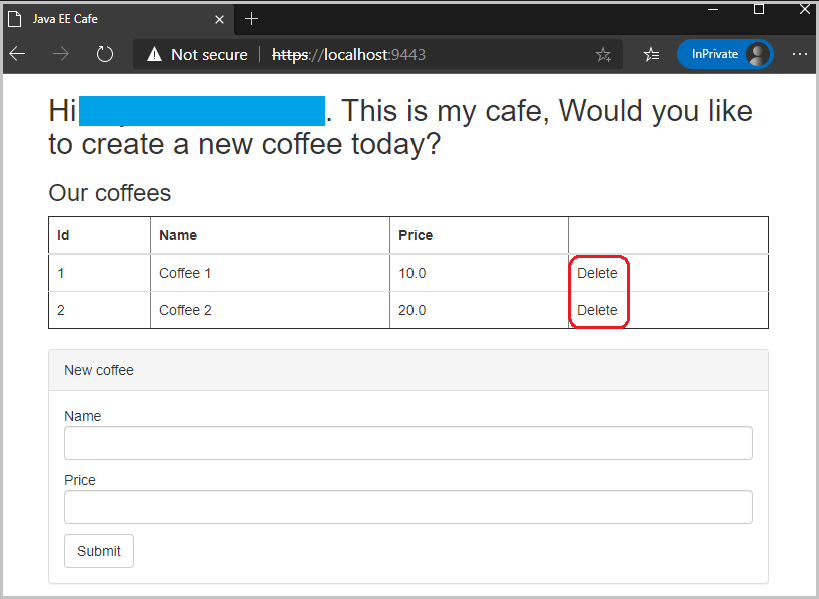
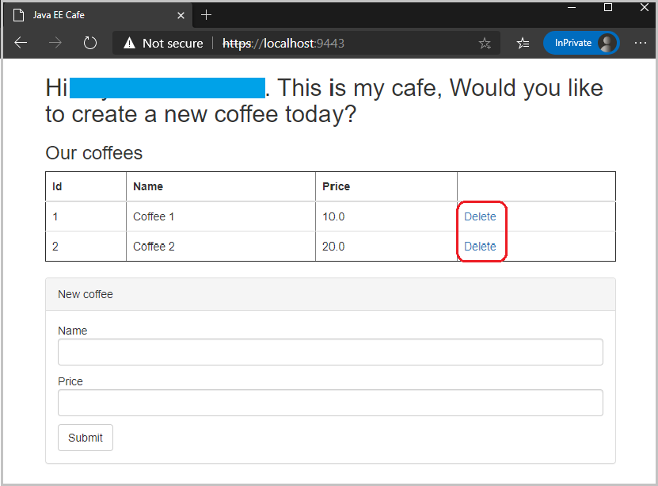

# Integrate your Liberty application with Azure Active Directory Domain Service via Secure LDAP

In this guide, you will integrate your Liberty application with Azure Active Directory Domain Service (Azure AD DS) via Secure LDAP for security. The Liberty application is running on an Azure Red Hat OpenShift (ARO) 4 cluster. You learn how to:
> [!div class="checklist"]
>
> * Set up Azure Active Directory
> * Prepare your application
> * Prepare application image
> * Deploy sample application

## Before you begin

In previous guide, a Java application, which is running inside Open Liberty/WebSphere Liberty runtime, is deployed to an ARO 4 cluster. If you have not done these steps, start with [Deploy a Java application with Open Liberty/WebSphere Liberty on an Azure Red Hat OpenShift 4 cluster](howto-deploy-java-liberty-app.md) and return here to continue.

### Set up Azure Active Directory

You've already set up an Azure Active Directory in the [previous guide](howto-deploy-java-liberty-app.md#set-up-azure-active-directory), complete the section [Azure Active Directory configuration](https://docs.microsoft.com/azure/developer/java/migration/migrate-weblogic-with-aad-ldap#azure-active-directory-configuration) to configure secure LDAP for an Azure AD DS managed domain.

### Trust singer certificate of the LDAP server

For SSL communication with an LDAP server to succeed, the signer certificate for the LDAP server must be added to the trust store that is referenced by the Liberty server. Execute the following commands to complete this step.

```bash
# Change directory to "<path-to-repo>/3-integration/aad-ldap"
cd <path-to-repo>/3-integration/aad-ldap

# Generate a key store file with additional user inputs
# Note: write down the specified key store name and key store password
keytool -genkeypair -keyalg RSA -storetype pkcs12 -keystore <KEYSTORE_NAME> -storepass <KEYSTORE_PASS>

# Import singer certificate of the LDAP server
# Note: "<path-to-ldap-server-certificate>" is the *.cer* file you were asked to save aside in section "Set up Azure Active Directory"
keytool -keystore <KEYSTORE_NAME> -storepass <KEYSTORE_PASS> -import -file <path-to-ldap-server-certificate> -alias ldap -trustcacerts -noprompt
```

### Collect parameter values for Liberty LDAP configuration

Besides the trust store generated above, collect other parameter values from the Azure AD DS deployed earlier by following the section [WLS Configuration](https://docs.microsoft.com/azure/developer/java/migration/migrate-weblogic-with-aad-ldap#wls-configuration).

| Parameter name | Description   | Value |
|----------------|---------------|---------|
| `LDAP_SERVER_HOST` | Domain name of LDAP server | Copied from `aadsServerHost` |
| `LDAP_SERVER_PORT` | Port of LDAP server | 636 |
| `LDAP_SERVER_IP_ADDRESS` | LDAP external IP address | Copied from `aadsPublicIP`|
| `LDAP_SERVER_BASEDN` | User Base DN   | Copied from `wlsLDAPUserBaseDN`,  |
| `LDAP_SERVER_BINDDN` | Principal | Copied from `wlsLDAPPrincipal` with double quote |
| `LDAP_SERVER_BINDPASSWORD` | Password for Principal | Copied from `wlsLDAPPrincipalPassword` with double quote |
| `ADMIN_GROUP_NAME` | Name of the administrator group | "AAD DC Administrators" |
| `KEYSTORE_NAME` | Name of the key store | The value you wrote down in section "Trust singer certificate of the LDAP server" |
| `KEYSTORE_PASS` | Password of the key store | The value you wrote down in section "Trust singer certificate of the LDAP server" |

## Prepare your application

The application `<path-to-repo>/2-simple` used in the [previous guide](howto-deploy-java-liberty-app.md#prepare-the-liberty-application) hasn't enabled authentication and authorization for security. To make it being protected by Azure AD, a number of files need to be updated or created:

| File Name             | Source Path                     | Destination Path              | Operation  | Description           |
|-----------------------|---------------------------------|-------------------------------|------------|-----------------------|  
| `server.xml` | [`<path-to-repo>/2-simple/src/main/liberty/config/server.xml`](https://github.com/Azure-Samples/open-liberty-on-aro/blob/master/2-simple/src/main/liberty/config/server.xml) | [`<path-to-repo>/3-integration/aad-ldap/src/main/liberty/config/server.xml`](https://github.com/Azure-Samples/open-liberty-on-aro/blob/master/3-integration/aad-ldap/src/main/liberty/config/server.xml) | Updated | Add `ldapRegistry-3.0`, `transportSecurity-1.0`, `appSecurity-3.0`, `jwt-1.0`, `mpJwt-1.1` features and their configurations. |
| `web.xml` | [`<path-to-repo>/2-simple/src/main/webapp/WEB-INF/web.xml`](https://github.com/Azure-Samples/open-liberty-on-aro/blob/master/2-simple/src/main/webapp/WEB-INF/web.xml) | [`<path-to-repo>/3-integration/aad-ldap/src/main/webapp/WEB-INF/web.xml`](https://github.com/Azure-Samples/open-liberty-on-aro/blob/master/3-integration/aad-ldap/src/main/webapp/WEB-INF/web.xml) | Updated | Add `security-role` and `security-constraint` for accessing web resources of the application. |
| `CafeRequestFilter.java` | | [`<path-to-repo>/3-integration/aad-ldap/src/main/java/cafe/web/view/CafeRequestFilter.java`](https://github.com/Azure-Samples/open-liberty-on-aro/blob/master/3-integration/aad-ldap/src/main/java/cafe/web/view/CafeRequestFilter.java) | New | A client request filter for generating JWT token with **groups claim**, and adding it in **HTTP Authorization Header** for outbound requests. |
| `Cafe.java` | [`<path-to-repo>/2-simple/src/mainjava/cafe/web/view/Cafe.java`](https://github.com/Azure-Samples/open-liberty-on-aro/blob/master/2-simple/src/main/java/cafe/web/view/Cafe.java) | [`<path-to-repo>/3-integration/aad-ldap/src/main/java/cafe/web/view/Cafe.java`](https://github.com/Azure-Samples/open-liberty-on-aro/blob/master/3-integration/aad-ldap/src/main/java/cafe/web/view/Cafe.java) | Updated | Register `CafeRequestFilter` for intercepting internal REST calls, add new APIs to get principal name of logged-on user and flag indicating whether the logged-on user can delete existing coffees or not. |
| `CafeResource.java` | [`<path-to-repo>/2-simple/src/main/java/cafe/web/rest/CafeResource.java`](https://github.com/Azure-Samples/open-liberty-on-aro/blob/master/2-simple/src/main/java/cafe/web/rest/CafeResource.java) | [`<path-to-repo>/3-integration/aad-ldap/src/main/java/cafe/web/rest/CafeResource.java`](https://github.com/Azure-Samples/open-liberty-on-aro/blob/master/3-integration/aad-ldap/src/main/java/cafe/web/rest/CafeResource.java) | Updated | Inject `JsonWebToken` to verify the **groups claim** of the token for RBAC. |
| `messages.properties` | [`<path-to-repo>/2-simple/src/main/resources/cafe/web/messages.properties`](https://github.com/Azure-Samples/open-liberty-on-aro/blob/master/2-simple/src/main/resources/cafe/web/messages.properties) | [`<path-to-repo>/3-integration/aad-ldap/src/main/resources/cafe/web/messages.properties`](https://github.com/Azure-Samples/open-liberty-on-aro/blob/master/3-integration/aad-ldap/src/main/resources/cafe/web/messages.properties) | Updated | Parameterize display name using the name of the logged-on user. |
| `messages_es.properties` | [`<path-to-repo>/2-simple/src/main/resources/cafe/web/messages_es.properties`](https://github.com/Azure-Samples/open-liberty-on-aro/blob/master/2-simple/src/main/resources/cafe/web/messages_es.properties) | [`<path-to-repo>/3-integration/aad-ldap/src/main/resources/cafe/web/messages_es.properties`](https://github.com/Azure-Samples/open-liberty-on-aro/blob/master/3-integration/aad-ldap/src/main/resources/cafe/web/messages_es.properties) | Updated | Parameterize display name using the name of the logged-on user. |
| `index.xhtml` | [`<path-to-repo>/2-simple/src/main/webapp/index.xhtml`](https://github.com/Azure-Samples/open-liberty-on-aro/blob/master/2-simple/src/main/webapp/index.xhtml) | [`<path-to-repo>/3-integration/aad-ldap/src/main/webapp/index.xhtml`](https://github.com/Azure-Samples/open-liberty-on-aro/blob/master/3-integration/aad-ldap/src/main/webapp/index.xhtml) | Updated | Display principal name of the logged-on user. Disable coffee delete button if the logged-on user is not authorized. |
| `pom.xml` | [`<path-to-repo>/2-simple/pom.xml`](https://github.com/Azure-Samples/open-liberty-on-aro/blob/master/2-simple/pom.xml) | [`<path-to-repo>/3-integration/aad-ldap/pom.xml`](https://github.com/Azure-Samples/open-liberty-on-aro/blob/master/3-integration/aad-ldap/pom.xml) | Updated | Add new properties and dependencies for LDAP Registry, and add new dependency for **Eclipse MicroProfile**. |

For reference, these changes have already been applied in `<path-to-repo>/3-integration/aad-ldap` of your local clone.

To run the sample application with `liberty-maven-plugin` in your local machine, execute the following commands:

```bash
cd <path-to-repo>/3-integration/aad-ldap
mvn clean package
mvn -Dldap.server.host=<LDAP_SERVER_HOST> -Dldap.server.port=<LDAP_SERVER_PORT> -Dldap.server.baseDN=<LDAP_SERVER_BASEDN> -Dldap.server.bindDN=<LDAP_SERVER_BINDDN> -Dldap.server.bindPassword=<LDAP_SERVER_BINDPASSWORD> -Dkeystore.name=<KEYSTORE_NAME> -Dkeystore.pass=<KEYSTORE_PASS> -Dadmin.group.name=<ADMIN_GROUP_NAME> liberty:dev
```

> [!NOTE]
>
> * **\<LDAP_SERVER_HOST>**, **\<LDAP_SERVER_PORT>**, **\<LDAP_SERVER_BASEDN>**, **\<LDAP_SERVER_BINDDN>**, **\<LDAP_SERVER_BINDPASSWORD>**, **\<KEYSTORE_NAME>**, **\<KEYSTORE_PASS>**, and **\<ADMIN_GROUP_NAME>** are parameters you collected before.
> * If you used a non-routable domain name for LDAP server, add a host name entry with LDAP external IP address to your operating system to workaround the DNS resolution issue. For example, add `<LDAP_SERVER_IP_ADDRESS> <LDAP_SERVER_HOST>` to `/etc/hosts` for most Unix-like systems, or `C:\Windows\System32\drivers\etc\hosts` for Windows system.

Once the application is up and running, open [https://localhost:9443](https://localhost:9443) in the **InPrivate** window of **Microsoft Edge**, verify the application is secured by Azure AD OpenID Connect.

1. Sign in using the **Name** of an Azure AD user, who doesn't belong to the admin group you specified before.
2. You will see the name of your Azure AD user displayed in the application home page, where the coffee **Delete** button is **disabled**.

   
3. Close the **InPrivate** window > open a new **InPrivate** window > sign in using the **Name** of another Azure AD user, who does belong to the admin group you specified before.
4. You will see the name of your Azure AD user displayed in the application home page, where the coffee **Delete** button is **enabled** now.

   
5. Press **Control-C** to stop the application and Open Liberty server.

## Prepare application image

To build the application image, Dockerfile needs to be prepared in advance:

| File Name             | Source Path                     | Destination Path              | Operation  | Description           |
|-----------------------|---------------------------------|-------------------------------|------------|-----------------------|  
| `Dockerfile` | [`<path-to-repo>/2-simple/Dockerfile`](https://github.com/Azure-Samples/open-liberty-on-aro/blob/master/2-simple/Dockerfile) | [`<path-to-repo>/3-integration/aad-ldap/Dockerfile`](https://github.com/Azure-Samples/open-liberty-on-aro/blob/master/3-integration/aad-ldap/Dockerfile) | Duplicated | Copied from `2-simple/Dockerfile`, which is based on Open Liberty base image. |
| `Dockerfile-wlp` | [`<path-to-repo>/2-simple/Dockerfile-wlp`](https://github.com/Azure-Samples/open-liberty-on-aro/blob/master/2-simple/Dockerfile-wlp) | [`<path-to-repo>/3-integration/aad-ldap/Dockerfile-wlp`](https://github.com/Azure-Samples/open-liberty-on-aro/blob/master/3-integration/aad-ldap/Dockerfile-wlp) | Duplicated | Copied from `2-simple/Dockerfile-wlp`, which is based on WebSphere Liberty base image. |

Follow steps below to build the application image:

```bash
# Change directory to "<path-to-repo>/3-integration/aad-ldap"
cd <path-to-repo>/3-integration/aad-ldap

# Build and tag application image
# Note:
# - replace "${Docker_File}" with "Dockerfile" to build application image with Open Liberty base image
# - replace "${Docker_File}" with "Dockerfile-wlp" to build application image with WebSphere Liberty base image
docker build -t javaee-cafe-aad-ldap:1.0.0 --pull --file=${Docker_File} .
```

After the application image is built, run with your local Docker to verify whether it works.

1. Run the following command in your console.

   ```bash
   docker run -it --rm -p 9443:9443 -e LDAP_SERVER_HOST=<LDAP_SERVER_HOST> -e LDAP_SERVER_PORT=<LDAP_SERVER_PORT> -e LDAP_SERVER_BASEDN=<LDAP_SERVER_BASEDN> -e LDAP_SERVER_BINDDN=<LDAP_SERVER_BINDDN> -e LDAP_SERVER_BINDPASSWORD=<LDAP_SERVER_BINDPASSWORD> -e KEYSTORE_NAME=<KEYSTORE_NAME> -e KEYSTORE_PASS=<KEYSTORE_PASS> -e ADMIN_GROUP_NAME=<ADMIN_GROUP_NAME> --mount type=bind,source=$(pwd)/src/main/liberty/config/<KEYSTORE_NAME>,target=/config/<KEYSTORE_NAME> javaee-cafe-aad-ldap:1.0.0
   ```

   > [!NOTE]
   >
   > * **\<LDAP_SERVER_HOST>**, **\<LDAP_SERVER_PORT>**, **\<LDAP_SERVER_BASEDN>**, **\<LDAP_SERVER_BINDDN>**, **\<LDAP_SERVER_BINDPASSWORD>**, **\<KEYSTORE_NAME>**, **\<KEYSTORE_PASS>**, and **\<ADMIN_GROUP_NAME>** are parameters you collected before.
   > * If you used a non-routable domain name for LDAP server, add a host name entry with LDAP external IP address to the container to workaround the DNS resolution issue. For example, add `--add-host <LDAP_SERVER_HOST>:<LDAP_SERVER_IP_ADDRESS>` to the arguments list.
   > * If you run the docker client from Windows Subsystem Linux and connects to the Docker daemon running in Windows, make sure the key store file specified in `source` for argument `--mount` is accessible from Windows system.

2. Wait for Liberty to start and the application to deploy successfully.
3. Open [https://localhost:9443/](https://localhost:9443/) in your browser to visit the application home page.
4. Press **Control-C** to stop the application and Liberty server.

When you're satisfied with the state of the application, push it to the built-in container image registry by following the instructions below:

1. Log in to the OpenShift web console from your browser using the credentials of the Azure AD user.
2. [Log in to the OpenShift CLI with the token for the Azure AD user](howto-deploy-java-liberty-app.md#log-in-to-the-openshift-cli-with-the-token).
3. Run the following commands to push the application image to the registry.

   ```bash
   # Note: replace "<Container_Registry_URL>" with the fully qualified name of the registry
   Container_Registry_URL=<Container_Registry_URL>

   # Create a new tag with registry info that refers to source image
   docker tag javaee-cafe-aad-ldap:1.0.0 ${Container_Registry_URL}/open-liberty-demo/javaee-cafe-aad-ldap:1.0.0

   # Log in to the built-in container image registry
   docker login -u $(oc whoami) -p $(oc whoami -t) ${Container_Registry_URL}

   # Push image to the built-in container image registry
   docker push ${Container_Registry_URL}/open-liberty-demo/javaee-cafe-aad-ldap:1.0.0
   ```

## Deploy sample application

To integrate the application with Azure AD OpenID Connect on the ARO 4 cluster, a number of Kubernetes resource YAML files need to be updated or created:

| File Name             | Source Path                     | Destination Path              | Operation  | Description           |
|-----------------------|---------------------------------|-------------------------------|------------|-----------------------|  
| `aad-ldap-secret.yaml` | | [`<path-to-repo>/3-integration/aad-ldap/aad-ldap-secret.yaml`](https://github.com/Azure-Samples/open-liberty-on-aro/blob/master/3-integration/aad-ldap/aad-ldap-secret.yaml) | New | A Kubernetes **Secret** resource with user input data, including `ldap.server.host`, `ldap.server.port`, `ldap.server.baseDN`, `ldap.server.bindDN`, `ldap.server.bindPassword`, `keystore.name`, `keystore.pass`, and `admin.group.name`. |
| `tls-crt-secret.yaml` | | [`<path-to-repo>/3-integration/tls-crt-secret.yaml`](https://github.com/Azure-Samples/open-liberty-on-aro/blob/master/3-integration/aad-ldap/tls-crt-secret.yaml) | New | A Kubernetes **Secret** resource with user input data, including `ca.crt`, `destCA.crt`, `tls.crt`, and `tls.key`. |
| `openlibertyapplication.yaml` | [`<path-to-repo>/2-simple/openlibertyapplication.yaml`](https://github.com/Azure-Samples/open-liberty-on-aro/blob/master/2-simple/openlibertyapplication.yaml) | [`<path-to-repo>/3-integration/aad-ldap/openlibertyapplication.yaml`](https://github.com/Azure-Samples/open-liberty-on-aro/blob/master/3-integration/aad-ldap/openlibertyapplication.yaml) | Updated | Add environment variables whose values are from Secret `aad-ldap-secret`. Mount key store file from ConfigMap `keystore-config`. Specify existing certificate for **Route** and **Service** of **OpenLibertyApplication** custom resource. |
| `openlibertyapplication-hosts.yaml` | | [`<path-to-repo>/3-integration/aad-ldap/openlibertyapplication-hosts.yaml`](https://github.com/Azure-Samples/open-liberty-on-aro/blob/master/3-integration/aad-ldap/openlibertyapplication-hosts.yaml) | New | Inherit from `openlibertyapplication.yaml` and add an init container which is responsible for modifying `/etc/hosts` by adding the host name entry with LDAP external IP address. |

For reference, these changes have already been applied in `<path-to-repo>/3-integration/aad-ldap` of your local clone.

Now you can deploy the sample Liberty application to the ARO 4 cluster with the following steps.

1. Log in to the OpenShift web console from your browser using the credentials of the Azure AD user.
2. [Log in to the OpenShift CLI with the token for the Azure AD user](howto-deploy-java-liberty-app.md#log-in-to-the-openshift-cli-with-the-token).
3. Run the following commands to deploy the application.

   ```bash
   # Change directory to "<path-to-repo>/3-integration/aad-ldap"
   cd <path-to-repo>/3-integration/aad-ldap

   # Change project to "open-liberty-demo"
   oc project open-liberty-demo

   # Create environment variables which will be passed to secret "aad-ldap-secret", ConfigMap "keystore-config" and OpenLibertyApplication "javaee-cafe-aad-ldap"
   # Note: replace "<LDAP_SERVER_HOST>", "<LDAP_SERVER_IP_ADDRESS>", "<LDAP_SERVER_PORT>", "<LDAP_SERVER_BASEDN>", "<LDAP_SERVER_BINDDN>", "<LDAP_SERVER_BINDPASSWORD>", "<KEYSTORE_NAME>", "<KEYSTORE_PASS>", and "<ADMIN_GROUP_NAME>" with the ones you noted down before
   export LDAP_SERVER_HOST=<LDAP_SERVER_HOST>
   export LDAP_SERVER_IP_ADDRESS=<LDAP_SERVER_IP_ADDRESS>
   export LDAP_SERVER_PORT=<LDAP_SERVER_PORT>
   export LDAP_SERVER_BASEDN=<LDAP_SERVER_BASEDN>
   export LDAP_SERVER_BINDDN=<LDAP_SERVER_BINDDN>
   export LDAP_SERVER_BINDPASSWORD=<LDAP_SERVER_BINDPASSWORD>
   export KEYSTORE_NAME=<KEYSTORE_NAME>
   export KEYSTORE_PASS=<KEYSTORE_PASS>
   export ADMIN_GROUP_NAME=<ADMIN_GROUP_NAME>

   # Create secret "aad-ldap-secret"
   envsubst < aad-ldap-secret.yaml | oc create -f -

   # Create ConfigMap keystore-config
   oc create configmap keystore-config --from-file=src/main/liberty/config/${KEYSTORE_NAME}

   # Create TLS private key and certificate, which is also used as CA certificate for testing purpose
   openssl req -x509 -sha256 -nodes -days 365 -newkey rsa:2048 -keyout tls.key -out tls.crt

   # Create environment variables which will be passed to secret "tls-crt-secret"
   export CA_CRT=$(cat tls.crt | base64 -w 0)
   export DEST_CA_CRT=$(cat tls.crt | base64 -w 0)
   export TLS_CRT=$(cat tls.crt | base64 -w 0)
   export TLS_KEY=$(cat tls.key | base64 -w 0)

   # Create secret "tls-crt-secret"
   envsubst < tls-crt-secret.yaml | oc create -f -

   # Note: change "IS_DOMAIN_NAME_ROUTABLE" to false if the domain name of the LDAP server is non-routable
   IS_DOMAIN_NAME_ROUTABLE=true

   # Create OpenLibertyApplication "javaee-cafe-aad-ldap"
   if [ "$IS_DOMAIN_NAME_ROUTABLE" = true ]; then
       envsubst < openlibertyapplication.yaml | oc create -f -
   else
       envsubst < openlibertyapplication-hosts.yaml | oc create -f -
   fi

   # Check if OpenLibertyApplication instance is created
   oc get openlibertyapplication javaee-cafe-aad-ldap

   # Check if deployment created by Operator is ready
   oc get deployment javaee-cafe-aad-ldap

   # Get host of the route
   HOST=$(oc get route javaee-cafe-aad-ldap --template='{{ .spec.host }}')
   echo "Route Host: $HOST"
   ```

Once the Liberty Application is up and running, replace **\<Route_Host>** with the console output of **Route Host** for `https://<Route_Host>`, and open it in your browser to visit the application home page.

### Lock down and secure LDAP access over the internet

While standing up the secure LDAP in the preceding steps, we had set the source as **Any** for the `AllowLDAPS` rule in the network security group.  Now that the Liberty application has been deployed and connected to LDAP, obtain the public IP address of `ingressProfile` for the ARO 4 cluster.

1. Log in to Azure CLI by running `az login` using your subscription in the console.
2. Run `az aro list -o table` to get list of deployed ARO 4 clusters. Find resource group name and cluster name from your specific ARO 4 cluster.
3. Run `az resource show -g <resource-group-name> -n <cluster-name> --resource-type "Microsoft.RedHatOpenShift/openShiftClusters` to get resource details of your ARO 4 cluster.
4. Write down the public IP address of `ingressProfile` from the output JSON body by following the JSON path `properties.ingressProfiles[0].ip`.

Revisit [Lock down secure LDAP access over the internet](https://docs.microsoft.com/azure/active-directory-domain-services/tutorial-configure-ldaps#lock-down-secure-ldap-access-over-the-internet) and change **Any** to the IP address of `ingressProfile` for the ARO 4 cluster.

## Next steps

In this guide, you learned how to:
> [!div class="checklist"]
>
> * Set up Azure Active Directory
> * Prepare your application
> * Prepare application image
> * Deploy sample application

Advance to these guides, which integrate Liberty application with other Azure services:
> [!div class="nextstepaction"]
> [Integrate your Liberty application with Elasticsearch stack](howto-integrate-elasticsearch-stack.md)

> [!div class="nextstepaction"]
> [Integrate your Liberty application with Azure managed databases](howto-integrate-azure-managed-databases.md)

> [!div class="nextstepaction"]
> [Set up your Liberty application in a multi-node stateless cluster with load balancing](howto-setup-stateless-cluster.md)

> [!div class="nextstepaction"]
> [Integrate your Liberty application with Azure Active Directory OpenID Connect](howto-integrate-aad-ldap.md)

If you've finished all of above guides, advance to the complete guide, which incorporates all of Azure service integrations:
> [!div class="nextstepaction"]
> [Integrate your Liberty application with different Azure services](howto-integrate-all.md)

Here are references used in this guide:

* [Azure Active Directory configuration](https://docs.microsoft.com/azure/developer/java/migration/migrate-weblogic-with-aad-ldap#azure-active-directory-configuration)
* [Configuring LDAP user registries in Liberty](https://www.ibm.com/support/knowledgecenter/SSEQTP_liberty/com.ibm.websphere.wlp.doc/ae/twlp_sec_ldap.html)
* [SSL configuration attributes](https://www.ibm.com/support/knowledgecenter/SSEQTP_liberty/com.ibm.websphere.wlp.doc/ae/rwlp_ssl.html)
* [Configuring the MicroProfile JSON Web Token](https://www.ibm.com/support/knowledgecenter/SSEQTP_liberty/com.ibm.websphere.wlp.doc/ae/twlp_sec_json.html)
* [Configuring authorization for applications in Liberty](https://www.ibm.com/support/knowledgecenter/SSEQTP_liberty/com.ibm.websphere.wlp.doc/ae/twlp_sec_rolebased.html)
* [LDAP User Registry](https://openliberty.io/docs/20.0.0.10/reference/config/ldapRegistry.html)
* [Securing a web application](https://openliberty.io/guides/security-intro.html)
