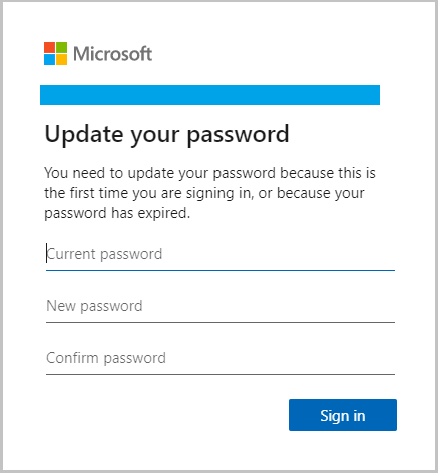
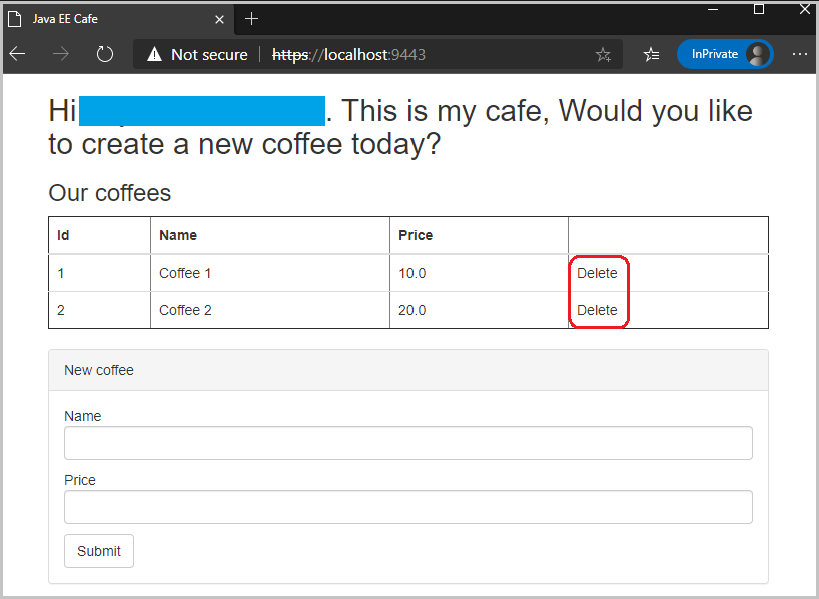

# Integrate your Liberty application with Azure Active Directory OpenID Connect

In this guide, you will integrate your Liberty application with Azure Active Directory OpenID Connect for security. The Liberty application is running on an Azure Red Hat OpenShift (ARO) 4 cluster. You learn how to:
> [!div class="checklist"]
>
> * Set up Azure Active Directory
> * Prepare your application
> * Prepare application image
> * Deploy sample application

## Before you begin

In previous guide, a Java application, which is running inside Open Liberty/WebSphere Liberty runtime, is deployed to an ARO 4 cluster. If you have not done these steps, start with [Deploy a Java application with Open Liberty/WebSphere Liberty on an Azure Red Hat OpenShift 4 cluster](howto-deploy-java-openliberty-app.md) and return here to continue.

## Set up Azure Active Directory

You've already set up an Azure Active Directory in the [previous guide](howto-deploy-java-openliberty-app.md#set-up-azure-active-directory), the **tenant ID**, Azure AD users, **client ID** and **client secret** you wrote down before will also be used in this guide. Furthermore, complete the following steps to set up additional configurations for your Azure Active Directory.

1. Open your **Azure AD** > **App registrations** > your **registered application** > **Authentication** > Click **Add URI** in **Redirect URIs** section > Input `https://localhost:9443/ibm/api/social-login/redirect/liberty-aad-oidc-javaeecafe` > Click **Save**.
   > [!NOTE]
   > You need to come back later to add another **Redirect URI** after the sample application is deployed to the ARO 4 cluster.
2. Create an **admin group** to enable JWT (Json Web Token) RBAC (role-based-access-control) functionality. Follow [create a basic group and add members using Azure Active Directory](https://docs.microsoft.com/azure/active-directory/fundamentals/active-directory-groups-create-azure-portal) to create a group with type as **Security** and add one or more members. Note down the **group ID**.
3. Add a **groups claim** into the ID token. In the application registration, click **Token configuration** > Click **Add groups claim** > Select **Security groups** as group types to include in the ID token > Expand **ID** and select **Group ID** in the **Customize token properties by type** section.

## Prepare your application

The application `<path-to-repo>/2-simple` used in the [previous guide](howto-deploy-java-openliberty-app.md) hasn't enabled authentication and authorization for security. To make it being protected by Azure AD, a number of files need to be updated or created:

| File Name             | Source Path                     | Destination Path              | Operation  | Description           |
|-----------------------|---------------------------------|-------------------------------|------------|-----------------------|  
| `server.xml` | [`<path-to-repo>/2-simple/src/main/liberty/config/server.xml`](https://github.com/Azure-Samples/open-liberty-on-aro/blob/master/2-simple/src/main/liberty/config/server.xml) | [`<path-to-repo>/3-integration/aad-oidc/src/main/liberty/config/server.xml`](https://github.com/Azure-Samples/open-liberty-on-aro/blob/master/3-integration/aad-oidc/src/main/liberty/config/server.xml) | Updated | Add `socialLogin-1.0`, `transportSecurity-1.0`, `appSecurity-3.0`, `jwt-1.0`, `mpJwt-1.1`, `mpConfig-1.3` features and their configurations. |
| `web.xml` | [`<path-to-repo>/2-simple/src/main/webapp/WEB-INF/web.xml`](https://github.com/Azure-Samples/open-liberty-on-aro/blob/master/2-simple/src/main/webapp/WEB-INF/web.xml) | [`<path-to-repo>/3-integration/aad-oidc/src/main/webapp/WEB-INF/web.xml`](https://github.com/Azure-Samples/open-liberty-on-aro/blob/master/3-integration/aad-oidc/src/main/webapp/WEB-INF/web.xml) | Updated | Add `security-role` and `security-constraint` for accessing web resources of the application. |
| `CafeJwtUtil.java` | | [`<path-to-repo>/3-integration/aad-oidc/src/main/java/cafe/web/view/CafeJwtUtil.java`](https://github.com/Azure-Samples/open-liberty-on-aro/blob/master/3-integration/aad-oidc/src/main/java/cafe/web/view/CafeJwtUtil.java) | New | The utility class for retrieving ID token issued from Azure AD, and providing an API to determine if the logged-on user is in the configured **admin group** of Azure AD. |
| `CafeRequestFilter.java` | | [`<path-to-repo>/3-integration/aad-oidc/src/main/java/cafe/web/view/CafeRequestFilter.java`](https://github.com/Azure-Samples/open-liberty-on-aro/blob/master/3-integration/aad-oidc/src/main/java/cafe/web/view/CafeRequestFilter.java) | New | A client request filter for adding JWT token in **HTTP Authorization Header** for outbound requests. |
| `Cafe.java` | [`<path-to-repo>/2-simple/src/mainjava/cafe/web/view/Cafe.java`](https://github.com/Azure-Samples/open-liberty-on-aro/blob/master/2-simple/src/main/java/cafe/web/view/Cafe.java) | [`<path-to-repo>/3-integration/aad-oidc/src/main/java/cafe/web/view/Cafe.java`](https://github.com/Azure-Samples/open-liberty-on-aro/blob/master/3-integration/aad-oidc/src/main/java/cafe/web/view/Cafe.java) | Updated | Register `CafeRequestFilter` for intercepting internal REST calls, add new APIs to get principal name of logged-on user and flag indicating whether the logged-on user can delete existing coffees or not. |
| `CafeResource.java` | [`<path-to-repo>/2-simple/src/main/java/cafe/web/rest/CafeResource.java`](https://github.com/Azure-Samples/open-liberty-on-aro/blob/master/2-simple/src/main/java/cafe/web/rest/CafeResource.java) | [`<path-to-repo>/3-integration/aad-oidc/src/main/java/cafe/web/rest/CafeResource.java`](https://github.com/Azure-Samples/open-liberty-on-aro/blob/master/3-integration/aad-oidc/src/main/java/cafe/web/rest/CafeResource.java) | Updated | Inject `JsonWebToken` to verify the **groups claim** of the token for RBAC. |
| `messages.properties` | [`<path-to-repo>/2-simple/src/main/resources/cafe/web/messages.properties`](https://github.com/Azure-Samples/open-liberty-on-aro/blob/master/2-simple/src/main/resources/cafe/web/messages.properties) | [`<path-to-repo>/3-integration/aad-oidc/src/main/resources/cafe/web/messages.properties`](https://github.com/Azure-Samples/open-liberty-on-aro/blob/master/3-integration/aad-oidc/src/main/resources/cafe/web/messages.properties) | Updated | Parameterize display name using the name of the logged-on user. |
| `messages_es.properties` | [`<path-to-repo>/2-simple/src/main/resources/cafe/web/messages_es.properties`](https://github.com/Azure-Samples/open-liberty-on-aro/blob/master/2-simple/src/main/resources/cafe/web/messages_es.properties) | [`<path-to-repo>/3-integration/aad-oidc/src/main/resources/cafe/web/messages_es.properties`](https://github.com/Azure-Samples/open-liberty-on-aro/blob/master/3-integration/aad-oidc/src/main/resources/cafe/web/messages_es.properties) | Updated | Parameterize display name using the name of the logged-on user. |
| `index.xhtml` | [`<path-to-repo>/2-simple/src/main/webapp/index.xhtml`](https://github.com/Azure-Samples/open-liberty-on-aro/blob/master/2-simple/src/main/webapp/index.xhtml) | [`<path-to-repo>/3-integration/aad-oidc/src/main/webapp/index.xhtml`](https://github.com/Azure-Samples/open-liberty-on-aro/blob/master/3-integration/aad-oidc/src/main/webapp/index.xhtml) | Updated | Display principal name of the logged-on user. Disable coffee delete button if the logged-on user is not authorized. |
| `pom.xml` | [`<path-to-repo>/2-simple/pom.xml`](https://github.com/Azure-Samples/open-liberty-on-aro/blob/master/2-simple/pom.xml) | [`<path-to-repo>/3-integration/aad-oidc/pom.xml`](https://github.com/Azure-Samples/open-liberty-on-aro/blob/master/3-integration/aad-oidc/pom.xml) | Updated | Add new properties and dependencies for Social Login, and add new dependency for **Eclipse MicroProfile**. |

For reference, these changes have already been applied in `<path-to-repo>/3-integration/aad-oidc` of your local clone.

To run the sample application with `liberty-maven-plugin` in your local machine, execute the following commands:

```bash
cd <path-to-repo>/3-integration/aad-oidc
mvn clean package
mvn -Dclient.id=<client ID> -Dclient.secret=<client secret> -Dtenant.id=<tenant ID> -Dadmin.group.id=<group ID> liberty:dev
```

> [!NOTE]
> **\<client ID>**, **\<client secret>**, **\<tenant ID>**, and **\<group ID>** are properties you wrote down in previous step "[Set up Azure Active Directory](#set-up-azure-active-directory)".

Once the application is up and running, open [https://localhost:9443](https://localhost:9443) in the **InPrivate** window of **Microsoft Edge**, verify the application is secured by Azure AD OpenID Connect.

1. Sign in as a user, who doesn't belong to the admin group you created before.
2. Update your password since this is the first time you are signing in.

   
3. Accept permission requested by the application.

   
4. You will see the email address of your AAD account displayed in the application home page, where the coffee **Delete** button is **disabled**.

   
5. Close the **InPrivate** window > open a new **InPrivate** window > sign in as another user, who does belong to the admin group you created before.
6. Update your password if necessary. Accept permission requested if necessary.
7. You will see the email address of your AAD account displayed in the application home page, where the coffee **Delete** button is **enabled** now.

   
8. Press **Control-C** to stop the application and Open Liberty server.

## Prepare application image

To build the application image, Dockerfile needs to be prepared in advance:

| File Name             | Source Path                     | Destination Path              | Operation  | Description           |
|-----------------------|---------------------------------|-------------------------------|------------|-----------------------|  
| `Dockerfile` | [`<path-to-repo>/2-simple/Dockerfile`](https://github.com/Azure-Samples/open-liberty-on-aro/blob/master/2-simple/Dockerfile) | [`<path-to-repo>/3-integration/aad-oidc/Dockerfile`](https://github.com/Azure-Samples/open-liberty-on-aro/blob/master/3-integration/aad-oidc/Dockerfile) | Duplicated | Copied from `2-simple/Dockerfile`, which is based on Open Liberty base image. |
| `Dockerfile-wlp` | [`<path-to-repo>/2-simple/Dockerfile-wlp`](https://github.com/Azure-Samples/open-liberty-on-aro/blob/master/2-simple/Dockerfile-wlp) | [`<path-to-repo>/3-integration/aad-oidc/Dockerfile-wlp`](https://github.com/Azure-Samples/open-liberty-on-aro/blob/master/3-integration/aad-oidc/Dockerfile-wlp) | Duplicated | Copied from `2-simple/Dockerfile-wlp`, which is based on WebSphere Liberty base image. |

Follow steps below to build the application image:

```bash
# Change directory to "<path-to-repo>/3-integration/aad-oidc"
cd <path-to-repo>/3-integration/aad-oidc

# Build and tag application image
# Note:
# - replace "${Docker_File}" with "Dockerfile" to build application image with Open Liberty base image
# - replace "${Docker_File}" with "Dockerfile-wlp" to build application image with WebSphere Liberty base image
docker build -t javaee-cafe-aad-oidc:1.0.0 --pull --file=${Docker_File} .
```

After the application image is built, run with your local Docker to verify whether it works.

1. Run `docker run -it --rm -p 9443:9443 -e CLIENT_ID=<client ID> -e CLIENT_SECRET=<client secret> -e TENANT_ID=<tenant ID> -e ADMIN_GROUP_ID=<group ID> javaee-cafe-aad-oidc:1.0.0` in your console.
   > [!NOTE]
   > **\<client ID>**, **\<client secret>**, **\<tenant ID>**, and **\<group ID>** are properties you wrote down in previous step "[Set up Azure Active Directory](#set-up-azure-active-directory)".

2. Wait for Liberty to start and the application to deploy successfully.
3. Open [https://localhost:9443/](https://localhost:9443/) in your browser to visit the application home page.
4. Press **Control-C** to stop the application and Liberty server.

When you're satisfied with the state of the application, push it to the built-in container image registry by following the instructions below:

1. Log in to the OpenShift web console from your browser using the credentials of the Azure AD user.
2. [Log in to the OpenShift CLI with the token for the Azure AD user](howto-deploy-java-openliberty-app.md#log-in-to-the-openshift-cli-with-the-token).
3. Run the following commands to push the application image to the registry.

   ```bash
   # Note: replace "<Container_Registry_URL>" with the fully qualified name of the registry
   Container_Registry_URL=<Container_Registry_URL>

   # Create a new tag with registry info that refers to source image
   docker tag javaee-cafe-aad-oidc:1.0.0 ${Container_Registry_URL}/open-liberty-demo/javaee-cafe-aad-oidc:1.0.0

   # Log in to the built-in container image registry
   docker login -u $(oc whoami) -p $(oc whoami -t) ${Container_Registry_URL}

   # Push image to the built-in container image registry
   docker push ${Container_Registry_URL}/open-liberty-demo/javaee-cafe-aad-oidc:1.0.0
   ```

## Deploy sample application

To integrate the application with Azure AD OpenID Connect on the ARO 4 cluster, a number of Kubernetes resource YAML files need to be updated or created:

| File Name             | Source Path                     | Destination Path              | Operation  | Description           |
|-----------------------|---------------------------------|-------------------------------|------------|-----------------------|  
| `aad-oidc-secret.yaml` | | [`<path-to-repo>/3-integration/aad-oidc/aad-oidc-secret.yaml`](https://github.com/Azure-Samples/open-liberty-on-aro/blob/master/3-integration/aad-oidc/aad-oidc-secret.yaml) | New | A Kubernetes **Secret** resource with user input data, including `client.id`, `client.secret`, `tenant.id`, and `admin.group.id`. |
| `tls-crt-secret.yaml` | | [`<path-to-repo>/3-integration/tls-crt-secret.yaml`](https://github.com/Azure-Samples/open-liberty-on-aro/blob/master/3-integration/aad-oidc/tls-crt-secret.yaml) | New | A Kubernetes **Secret** resource with user input data, including `ca.crt`, `destCA.crt`, `tls.crt`, and `tls.key`. |
| `openlibertyapplication.yaml` | [`<path-to-repo>/2-simple/openlibertyapplication.yaml`](https://github.com/Azure-Samples/open-liberty-on-aro/blob/master/2-simple/openlibertyapplication.yaml) | [`<path-to-repo>/3-integration/aad-oidc/openlibertyapplication.yaml`](https://github.com/Azure-Samples/open-liberty-on-aro/blob/master/3-integration/aad-oidc/openlibertyapplication.yaml) | Updated | Add environment variables whose values are from Secret `aad-oidc-secret`. Specify existing certificate for **Route** and **Service** of **OpenLibertyApplication** custom resource. |

For reference, these changes have already been applied in `<path-to-repo>/3-integration/aad-oidc` of your local clone.

Now you can deploy the sample Liberty application to the ARO 4 cluster with the following steps.

1. Log in to the OpenShift web console from your browser using the credentials of the Azure AD user.
2. [Log in to the OpenShift CLI with the token for the Azure AD user](howto-deploy-java-openliberty-app.md#log-in-to-the-openshift-cli-with-the-token).
3. Run the following commands to deploy the application.

   ```bash
   # Change directory to "<path-to-repo>/3-integration/aad-oidc"
   cd <path-to-repo>/3-integration/aad-oidc

   # Change project to "open-liberty-demo"
   oc project open-liberty-demo

   # Create environment variables which will be passed to secret "aad-oidc-secret"
   # Note: replace "<client ID>", "<client secret>", "<tenant ID>", and "<group ID>" with the ones you noted down before
   export CLIENT_ID=<client ID>
   export CLIENT_SECRET=<client secret>
   export TENANT_ID=<tenant ID>
   export ADMIN_GROUP_ID=<group ID>

   # Create secret "aad-oidc-secret"
   envsubst < aad-oidc-secret.yaml | oc create -f -

   # Create TLS private key and certificate, which is also used as CA certificate for testing purpose
   openssl req -x509 -sha256 -nodes -days 365 -newkey rsa:2048 -keyout tls.key -out tls.crt

   # Create environment variables which will be passed to secret "tls-crt-secret"
   export CA_CRT=$(cat tls.crt | base64 -w 0)
   export DEST_CA_CRT=$(cat tls.crt | base64 -w 0)
   export TLS_CRT=$(cat tls.crt | base64 -w 0)
   export TLS_KEY=$(cat tls.key | base64 -w 0)

   # Create secret "tls-crt-secret"
   envsubst < tls-crt-secret.yaml | oc create -f -

   # Create OpenLibertyApplication "javaee-cafe-aad-oidc"
   oc create -f openlibertyapplication.yaml

   # Check if OpenLibertyApplication instance is created
   oc get openlibertyapplication javaee-cafe-aad-oidc

   # Check if deployment created by Operator is ready
   oc get deployment javaee-cafe-aad-oidc

   # Get host of the route
   HOST=$(oc get route javaee-cafe-aad-oidc --template='{{ .spec.host }}')
   echo "Route Host: $HOST"
   ```

Once the Liberty Application is up and running, copy the value of **Route Host** from console output.

1. Open your **Azure AD** > **App registrations** > your **registered application** > **Authentication** > Click **Add URI** in **Redirect URIs** section > Replace **\<Route_Host>** with the value of **Route Host** for `https://<Route_Host>/ibm/api/social-login/redirect/liberty-aad-oidc-javaeecafe`, and fill it into the text box > Click **Save**.
2. Replace **\<Route_Host>** with the value of **Route Host** for `https://<Route_Host>`, and open it in your browser to visit the application home page.

## Next steps

In this guide, you learned how to:
> [!div class="checklist"]
>
> * Set up Azure Active Directory
> * Prepare your application
> * Prepare application image
> * Deploy sample application

Advance to these guides, which integrate Liberty application with other Azure services:
> [!div class="nextstepaction"]
> [Integrate your Liberty application with Elasticsearch stack](howto-integrate-elasticsearch-stack.md)

> [!div class="nextstepaction"]
> [Integrate your Liberty application with Azure managed databases](howto-integrate-azure-managed-databases.md)

If you've finished all of above guides, advance to the complete guide, which incorporates all of Azure service integrations:
> [!div class="nextstepaction"]
> [Integrate your Liberty application with different Azure services](howto-integrate-all.md)

Here are references used in this guide:

* [Quickstart: Set up a tenant](https://docs.microsoft.com/azure/active-directory/develop/quickstart-create-new-tenant)
* [Add or delete users using Azure Active Directory](https://docs.microsoft.com/azure/active-directory/fundamentals/add-users-azure-active-directory)
* [Create a basic group and add members using Azure Active Directory](https://docs.microsoft.com/azure/active-directory/fundamentals/active-directory-groups-create-azure-portal)
* [Quickstart: Register an application with the Microsoft identity platform](https://docs.microsoft.com/azure/active-directory/develop/quickstart-register-app)
* [Secure your application by using OpenID Connect and Azure AD](https://docs.microsoft.com/learn/modules/secure-app-with-oidc-and-azure-ad/)
* [Configure social login as OpenID Connect client](https://www.ibm.com/support/knowledgecenter/SSEQTP_liberty/com.ibm.websphere.wlp.doc/ae/twlp_sec_sociallogin.html#twlp_sec_sociallogin__openid)
* [Configuring the MicroProfile JSON Web Token](https://www.ibm.com/support/knowledgecenter/SSEQTP_liberty/com.ibm.websphere.wlp.doc/ae/twlp_sec_json.html)
* [Configuring authorization for applications in Liberty](https://www.ibm.com/support/knowledgecenter/SSEQTP_liberty/com.ibm.websphere.wlp.doc/ae/twlp_sec_rolebased.html)
