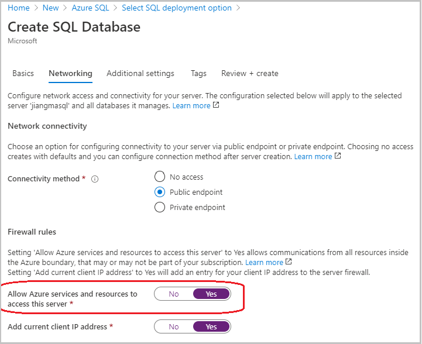
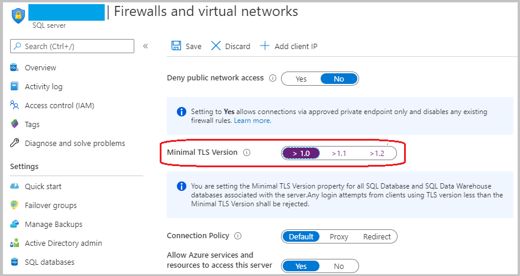
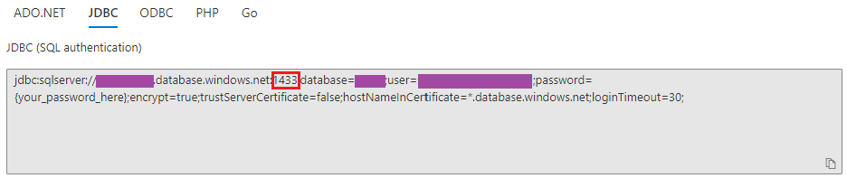
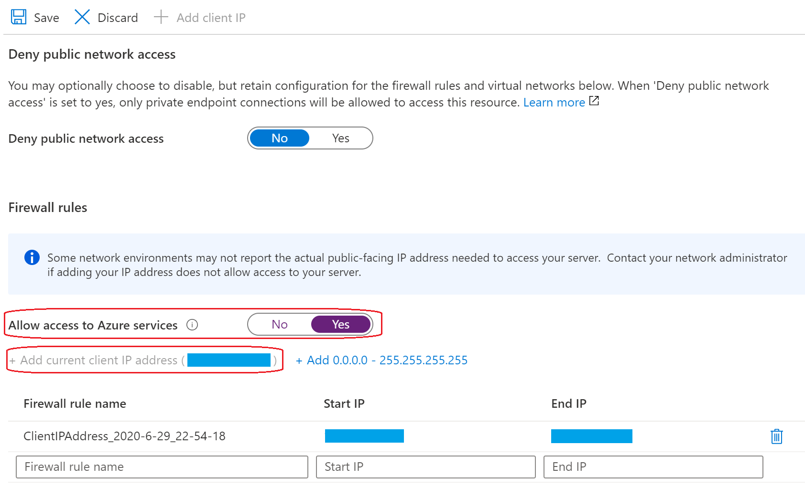
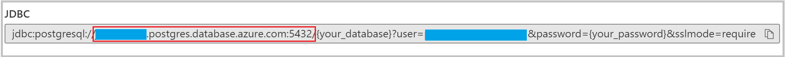

# Integrate your Liberty application with Azure managed databases

[Azure managed databases](https://azure.microsoft.com/product-categories/databases/) are managed, intelligent, and flexible cloud database services offered by Microsoft Azure. In this guide, you will integrate your Liberty application with Azure managed databases to enable data persistence. The Liberty application is running on an Azure Red Hat OpenShift (ARO) 4 cluster. You learn how to:
> [!div class="checklist"]
>
> * Connect your application to Azure SQL Database
> * Connect your application to Azure Database for PostgreSQL

## Before you begin

In previous guide, a Java application, which is running inside Open Liberty/WebSphere Liberty runtime, is deployed to an ARO 4 cluster. If you have not done these steps, start with [Deploy a Java application with Open Liberty/WebSphere Liberty on an Azure Red Hat OpenShift 4 cluster](howto-deploy-java-liberty-app.md) and return here to continue.

## Connect your application to Azure SQL Database

Part of the Azure SQL family, [Azure SQL Database](https://azure.microsoft.com/services/sql-database/) is the intelligent, scalable, and relational database service built for the cloud. Using Azure SQL Database for persisting your application's data, you can focus on application development as a developer.

### Create an Azure SQL Database single database

Follow the instructions below to set up an Azure SQL Database single database for connectivity.

1. Create a single database in Azure SQL Database by following "[Quickstart: Create an Azure SQL Database single database](https://docs.microsoft.com/azure/azure-sql/database/single-database-create-quickstart)".
   > [!NOTE]
   >
   > * At **Basics** step, write down **Database name**, ***Server name**.database.windows.net*, **Server admin login** and **Password**.
   > * At **Networking** step, set **Connectivity method** to **Public endpoint**, **Allow Azure services and resources to access this server** to **Yes**, and **Add current client IP address** to **Yes**.
   >
   >   
   > * At **Additional settings** step, set **Enable advanced data security** to **Not now**.

2. Once your database is created, open **your SQL server** > **Firewalls and virtual networks** > Set **Minimal TLS Version** to **>1.0** > Click **Save**.

   
3. Open **your SQL database** > **Connection strings** > Select **JDBC**. Write down the **Port number** following sql server address. For example, **1433** is the port number in the example below.

   

### Prepare your application

The application `<path-to-repo>/2-simple` used in the [previous guide](howto-deploy-java-liberty-app.md#prepare-the-liberty-application) has no database connectivity. To make it connect to Azure SQL Database, a number of files need to be updated or created:.

| File Name             | Source Path                     | Destination Path              | Operation  | Description           |
|-----------------------|---------------------------------|-------------------------------|------------|-----------------------|  
| `server.xml` | [`<path-to-repo>/2-simple/src/main/liberty/config/server.xml`](https://github.com/Azure-Samples/open-liberty-on-aro/blob/master/2-simple/src/main/liberty/config/server.xml) | [`<path-to-repo>/3-integration/connect-db/mssql/src/main/liberty/config/server.xml`](https://github.com/Azure-Samples/open-liberty-on-aro/blob/master/3-integration/connect-db/mssql/src/main/liberty/config/server.xml) | Updated | Add `jpa-2.2` feature, `dataSource` and `library` configurations for database connection. |
| `persistence.xml` | | [`<path-to-repo>/3-integration/connect-db/mssql/src/main/resources/META-INF/persistence.xml`](https://github.com/Azure-Samples/open-liberty-on-aro/blob/master/3-integration/connect-db/mssql/src/main/resources/META-INF/persistence.xml) | New | A configuration file specifying data persistence schema for your application. |
| `Coffee.java` | [`<path-to-repo>/2-simple/src/main/java/cafe/model/entity/Coffee.java`](https://github.com/Azure-Samples/open-liberty-on-aro/blob/master/2-simple/src/main/java/cafe/model/entity/Coffee.java) | [`<path-to-repo>/3-integration/connect-db/mssql/src/main/java/cafe/model/entity/Coffee.java`](https://github.com/Azure-Samples/open-liberty-on-aro/blob/master/3-integration/connect-db/mssql/src/main/java/cafe/model/entity/Coffee.java) | Updated | Register `Coffee` class as a JPA Entity. |
| `CafeRepository.java` | [`<path-to-repo>/2-simple/src/main/java/cafe/model/CafeRepository.java`](https://github.com/Azure-Samples/open-liberty-on-aro/blob/master/2-simple/src/main/java/cafe/model/CafeRepository.java) | [`<path-to-repo>/3-integration/connect-db/mssql/src/main/java/cafe/model/CafeRepository.java`](https://github.com/Azure-Samples/open-liberty-on-aro/blob/master/3-integration/connect-db/mssql/src/main/java/cafe/model/CafeRepository.java) | Updated | Register `CafeRepository` class as a Stateless Bean which implements CRUD operations using `javax.persistence.EntityManager` and `javax.persistence.PersistenceContext` APIs. |
| `pom.xml` | [`<path-to-repo>/2-simple/pom.xml`](https://github.com/Azure-Samples/open-liberty-on-aro/blob/master/2-simple/pom.xml) | [`<path-to-repo>/3-integration/connect-db/mssql/pom.xml`](https://github.com/Azure-Samples/open-liberty-on-aro/blob/master/3-integration/connect-db/mssql/pom.xml) | Updated | Add new properties and dependencies for database connection, and add new plugin `maven-dependency-plugin`. |

For reference, these changes have already been applied in `<path-to-repo>/3-integration/connect-db/mssql` of your local clone.

To run the sample application with `liberty-maven-plugin` in your local machine, execute the following commands:

```bash
cd <path-to-repo>/3-integration/connect-db/mssql
mvn clean package
mvn -Ddb.server.name=<Server name>.database.windows.net -Ddb.port.number=<Port number> -Ddb.name=<Database name> -Ddb.user=<Server admin login>@<Server name> -Ddb.password=<Password> liberty:dev
```

> [!NOTE]
>
> * **\<Database name>**, **\<Server name>**, **\<Server admin login>**, **\<Password>** and **\<Port number>** are properties you wrote down in previous step "[Create an Azure SQL Database single database](#create-an-azure-sql-database-single-database)".
> * [Create a firewall rule](https://docs.microsoft.com/azure/azure-sql/database/firewall-create-server-level-portal-quickstart) for IP address of your client if you encountered the similar error below. Then re-run the application.
>   * [ERROR   ] CWWJP9992E: Exception [EclipseLink-4002] (Eclipse Persistence Services - 2.7.7.v20200504-69f2c2b80d): org.eclipse.persistence.exceptions.DatabaseExceptionInternal Exception: java.sql.SQLException: Cannot open server 'xxxxxxx' requested by the login. Client with IP address 'xxx.xxx.xxx.xx' is not allowed to access the server.  To enable access, use the Windows Azure Management Portal or run sp_set_firewall_rule on the master database to create a firewall rule for this IP address or address range.  It may take up to five minutes for this change to take effect. ClientConnectionId:xxxx-xxxx-xxxx-xxxx-xxxx: SQL State = S0001, Error Code = 40,615

Once the application is up and running, open [http://localhost:9080](http://localhost:9080) in your browser, verify the database connectivity works by creating new coffees and deleting existing coffees in the home page. Press **Control-C** to stop the application and Open Liberty server.

### Prepare application image

To build the application image, Dockerfile needs to be prepared in advance:

| File Name             | Source Path                     | Destination Path              | Operation  | Description           |
|-----------------------|---------------------------------|-------------------------------|------------|-----------------------|  
| `Dockerfile` | [`<path-to-repo>/2-simple/Dockerfile`](https://github.com/Azure-Samples/open-liberty-on-aro/blob/master/2-simple/Dockerfile) | [`<path-to-repo>/3-integration/connect-db/mssql/Dockerfile`](https://github.com/Azure-Samples/open-liberty-on-aro/blob/master/3-integration/connect-db/mssql/Dockerfile) | Updated | Add JDBC driver into application image, which is based on Open Liberty base image. |
| `Dockerfile-wlp` | [`<path-to-repo>/2-simple/Dockerfile-wlp`](https://github.com/Azure-Samples/open-liberty-on-aro/blob/master/2-simple/Dockerfile-wlp) | [`<path-to-repo>/3-integration/connect-db/mssql/Dockerfile-wlp`](https://github.com/Azure-Samples/open-liberty-on-aro/blob/master/3-integration/connect-db/mssql/Dockerfile-wlp) | Updated | Add JDBC driver into application image, which is based on WebSphere Liberty base image. |

Follow steps below to build the application image:

1. Change directory to `<path-to-repo>/3-integration/connect-db/mssql` of your local clone.
2. Download [mssql-jdbc-8.2.2.jre8.jar](https://repo1.maven.org/maven2/com/microsoft/sqlserver/mssql-jdbc/8.2.2.jre8/mssql-jdbc-8.2.2.jre8.jar) and put it to current working directory.
3. Run the following commands to build application image.

   ```bash
   # Build and tag application image
   # Note:
   # - replace "${Docker_File}" with "Dockerfile" to build application image with Open Liberty base image
   # - replace "${Docker_File}" with "Dockerfile-wlp" to build application image with WebSphere Liberty base image
   docker build -t javaee-cafe-connect-db-mssql:1.0.0 --pull --file=${Docker_File} .
   ```

After the application image is built, run with your local Docker to verify whether it works.

1. Run `docker run -it --rm -p 9080:9080 -e DB_SERVER_NAME=<Server name>.database.windows.net -e DB_PORT_NUMBER=<Port number> -e DB_NAME=<Database name> -e DB_USER=<Server admin login>@<Server name> -e DB_PASSWORD=<Password> javaee-cafe-connect-db-mssql:1.0.0` in your console.
   > [!NOTE]
   >
   > * **\<Database name>**, **\<Server name>**, **\<Server admin login>**, **\<Password>** and **\<Port number>** are properties you wrote down in previous step "[Create an Azure SQL Database single database](#create-an-azure-sql-database-single-database)".
   > * [Create a firewall rule](https://docs.microsoft.com/azure/azure-sql/database/firewall-create-server-level-portal-quickstart) for IP address of your client if you encountered the similar error below. Then re-run the application.
   >   * [ERROR   ] CWWJP9992E: Exception [EclipseLink-4002] (Eclipse Persistence Services - 2.7.7.v20200504-69f2c2b80d): org.eclipse.persistence.exceptions.DatabaseExceptionInternal Exception: java.sql.SQLException: Cannot open server 'xxxxxxx' requested by the login. Client with IP address 'xxx.xxx.xxx.xx' is not allowed to access the server.  To enable access, use the Windows Azure Management Portal or run sp_set_firewall_rule on the master database to create a firewall rule for this IP address or address range.  It may take up to five minutes for this change to take effect. ClientConnectionId:xxxx-xxxx-xxxx-xxxx-xxxx DSRA0010E: SQL State = S0001, Error Code = 40,615

2. Wait for Liberty to start and the application to deploy successfully.
3. Open [http://localhost:9080/](http://localhost:9080/) in your browser to visit the application home page.
4. Press **Control-C** to stop the application and Liberty server.

When you're satisfied with the state of the application, push it to the built-in container image registry by following the instructions below:

1. Log in to the OpenShift web console from your browser using the credentials of the Azure AD user.
2. [Log in to the OpenShift CLI with the token for the Azure AD user](howto-deploy-java-liberty-app.md#log-in-to-the-openshift-cli-with-the-token).
3. Run the following commands to push the application image to the registry.

   ```bash
   # Note: replace "<Container_Registry_URL>" with the fully qualified name of the registry
   Container_Registry_URL=<Container_Registry_URL>

   # Create a new tag with registry info that refers to source image
   docker tag javaee-cafe-connect-db-mssql:1.0.0 ${Container_Registry_URL}/open-liberty-demo/javaee-cafe-connect-db-mssql:1.0.0

   # Log in to the built-in container image registry
   docker login -u $(oc whoami) -p $(oc whoami -t) ${Container_Registry_URL}

   # Push image to the built-in container image registry
   docker push ${Container_Registry_URL}/open-liberty-demo/javaee-cafe-connect-db-mssql:1.0.0
   ```

### Deploy sample application

To make the application connect to the Azure SQL Database for data persistence, a number of Kubernetes resource YAML files need to be updated or created:

| File Name             | Source Path                     | Destination Path              | Operation  | Description           |
|-----------------------|---------------------------------|-------------------------------|------------|-----------------------|  
| `db-secret.yaml` | | [`<path-to-repo>/3-integration/connect-db/db-secret.yaml`](https://github.com/Azure-Samples/open-liberty-on-aro/blob/master/3-integration/connect-db/db-secret.yaml) | New | A Kubernetes **Secret** resource with database connection credentials, including `db.server.name`, `db.port.number`, `db.name`, `db.user`, and `db.password`. |
| `openlibertyapplication.yaml` | [`<path-to-repo>/2-simple/openlibertyapplication.yaml`](https://github.com/Azure-Samples/open-liberty-on-aro/blob/master/2-simple/openlibertyapplication.yaml) | [`<path-to-repo>/3-integration/connect-db/openlibertyapplication.yaml`](https://github.com/Azure-Samples/open-liberty-on-aro/blob/master/3-integration/connect-db/openlibertyapplication.yaml) | Updated | Add environment variables whose values are from Secret `db-secret-mssql`. |

For reference, these changes have already been applied in `<path-to-repo>/3-integration/connect-db` of your local clone.

Now you can deploy the sample Liberty application to the ARO 4 cluster with the following steps.

1. Log in to the OpenShift web console from your browser using the credentials of the Azure AD user.
2. [Log in to the OpenShift CLI with the token for the Azure AD user](howto-deploy-java-liberty-app.md#log-in-to-the-openshift-cli-with-the-token).
3. Run the following commands to deploy the application.

   ```bash
   # Change directory to "<path-to-repo>/3-integration/connect-db"
   cd <path-to-repo>/3-integration/connect-db

   # Change project to "open-liberty-demo"
   oc project open-liberty-demo

   # Create environment variables which will be passed to secret "db-secret-mssql"
   # Note: replace "<Server name>", "<Port number>", "<Database name>", "<Server admin login>", and "<Password>" with the ones you noted down before
   export DB_Type=mssql
   export DB_SERVER_NAME=<Server name>.database.windows.net
   export DB_PORT_NUMBER=<Port number>
   export DB_NAME=<Database name>
   export DB_USER=<Server admin login>@<Server name>
   export DB_PASSWORD=<Password>

   # Create secret "db-secret-mssql"
   envsubst < db-secret.yaml | oc create -f -

   # Create environment variables which will be passed to OpenLibertyApplication "javaee-cafe-connect-db-mssql"
   export Image_Name=javaee-cafe-connect-db-mssql

   # Create OpenLibertyApplication "javaee-cafe-connect-db-mssql"
   envsubst < openlibertyapplication.yaml | oc create -f -

   # Check if OpenLibertyApplication instance is created
   oc get openlibertyapplication javaee-cafe-connect-db-mssql

   # Check if deployment created by Operator is ready
   oc get deployment javaee-cafe-connect-db-mssql

   # Get host of the route
   HOST=$(oc get route javaee-cafe-connect-db-mssql --template='{{ .spec.host }}')
   echo "Route Host: $HOST"
   ```

Once the Liberty Application is up and running, open the output of **Route Host** in your browser to visit the application home page.

## Connect your application to Azure Database for PostgreSQL

[Azure Database for PostgreSQL](https://azure.microsoft.com/services/postgresql/) is another fully managed database service from Microsoft Azure, based on community [PostgreSQL](https://docs.microsoft.com/azure/postgresql/concepts-supported-versions). Using Azure Database for PostgreSQL, developers can build or migrate their workloads with confidence.

### Create an Azure Database for PostgreSQL server

Follow the instructions below to set up an Azure Database for PostgreSQL server for data persistence.

1. Create an Azure Database for PostgreSQL server by following [Create an Azure Database for PostgreSQL server](https://docs.microsoft.com/azure/postgresql/quickstart-create-server-database-portal#create-an-azure-database-for-postgresql-server).
   > [!NOTE]
   > At **Basics** step, write down **Admin username** and **Password**.
2. Once your database is created, open **your Azure Database for PostgreSQL server** > **Connection security** > Set **Allow access to Azure services** to **Yes** > Click **+ Add current client IP address** > Click **Save**.

   
3. Open **your Azure Database for PostgreSQL server** > **Connection strings** > **JDBC**. Write down the **Server name** and **Port number** in ***Server name**.postgres.database.azure.com:**Port number*** format.

   

### Prepare your application (PostgreSQL)

The application `<path-to-repo>/2-simple` used in the [previous guide](howto-deploy-java-liberty-app.md#prepare-the-liberty-application) has no database connectivity. To make it connect to Azure Database for PostgreSQL, a number of files need to be updated or created:.

| File Name             | Source Path                     | Destination Path              | Operation  | Description           |
|-----------------------|---------------------------------|-------------------------------|------------|-----------------------|  
| `server.xml` | [`<path-to-repo>/2-simple/src/main/liberty/config/server.xml`](https://github.com/Azure-Samples/open-liberty-on-aro/blob/master/2-simple/src/main/liberty/config/server.xml) | [`<path-to-repo>/3-integration/connect-db/postgres/src/main/liberty/config/server.xml`](https://github.com/Azure-Samples/open-liberty-on-aro/blob/master/3-integration/connect-db/postgres/src/main/liberty/config/server.xml) | Updated | Add `jpa-2.2` feature, `dataSource` and `library` configurations for database connection. |
| `persistence.xml` | | [`<path-to-repo>/3-integration/connect-db/postgres/src/main/resources/META-INF/persistence.xml`](https://github.com/Azure-Samples/open-liberty-on-aro/blob/master/3-integration/connect-db/postgres/src/main/resources/META-INF/persistence.xml) | New | A configuration file specifying data persistence schema for your application. |
| `Coffee.java` | [`<path-to-repo>/2-simple/src/main/java/cafe/model/entity/Coffee.java`](https://github.com/Azure-Samples/open-liberty-on-aro/blob/master/2-simple/src/main/java/cafe/model/entity/Coffee.java) | [`<path-to-repo>/3-integration/connect-db/postgres/src/main/java/cafe/model/entity/Coffee.java`](https://github.com/Azure-Samples/open-liberty-on-aro/blob/master/3-integration/connect-db/postgres/src/main/java/cafe/model/entity/Coffee.java) | Updated | Register `Coffee` class as a JPA Entity. |
| `CafeRepository.java` | [`<path-to-repo>/2-simple/src/main/java/cafe/model/CafeRepository.java`](https://github.com/Azure-Samples/open-liberty-on-aro/blob/master/2-simple/src/main/java/cafe/model/CafeRepository.java) | [`<path-to-repo>/3-integration/connect-db/postgres/src/main/java/cafe/model/CafeRepository.java`](https://github.com/Azure-Samples/open-liberty-on-aro/blob/master/3-integration/connect-db/postgres/src/main/java/cafe/model/CafeRepository.java) | Updated | Register `CafeRepository` class as a Stateless Bean which implements CRUD operations using `javax.persistence.EntityManager` and `javax.persistence.PersistenceContext` APIs. |
| `pom.xml` | [`<path-to-repo>/2-simple/pom.xml`](https://github.com/Azure-Samples/open-liberty-on-aro/blob/master/2-simple/pom.xml) | [`<path-to-repo>/3-integration/connect-db/postgres/pom.xml`](https://github.com/Azure-Samples/open-liberty-on-aro/blob/master/3-integration/connect-db/postgres/pom.xml) | Updated | Add new properties and dependencies for database connection, and add new plugin `maven-dependency-plugin`. |

For reference, these changes have already been applied in `<path-to-repo>/3-integration/connect-db/postgres` of your local clone.

To run the sample application with `liberty-maven-plugin` in your local machine, execute the following commands:

```bash
cd <path-to-repo>/3-integration/connect-db/postgres
mvn clean package
mvn -Ddb.server.name=<Server name>.postgres.database.azure.com -Ddb.port.number=<Port number> -Ddb.name=postgres -Ddb.user=<Admin username>@<Server name> -Ddb.password=<Password> liberty:dev
```

> [!NOTE]
>
> * **\<Server name>**, **\<Port number>**, **\<Admin username>** and **\<Password>** are properties you wrote down in previous step "[Create an Azure Database for PostgreSQL server](#create-an-azure-database-for-postgresql-server)".
> * [Create a firewall rule](https://docs.microsoft.com/azure/postgresql/howto-manage-firewall-using-portal) for IP address of your client if you encountered the similar error below. Then re-run the application.
>   * [ERROR   ] CWWJP9992E: Exception [EclipseLink-4002] (Eclipse Persistence Services - 2.7.7.v20200504-69f2c2b80d): org.eclipse.persistence.exceptions.DatabaseException. Internal Exception: java.sql.SQLException: FATAL: no pg_hba.conf entry for host "xxx.xxx.xxx.xxx", user "xxxxxx", database "xxxxxx", SSL on DSRA0010E: SQL State = 28000, Error Code = 0

Once the application is up and running, open [http://localhost:9080](http://localhost:9080) in your browser, verify the database connectivity works by creating new coffees and deleting existing coffees in the home page. Press **Control-C** to stop the application and Open Liberty server.

### Prepare application image (PostgreSQL)

To build the application image, Dockerfile needs to be prepared in advance:

| File Name             | Source Path                     | Destination Path              | Operation  | Description           |
|-----------------------|---------------------------------|-------------------------------|------------|-----------------------|  
| `Dockerfile` | [`<path-to-repo>/2-simple/Dockerfile`](https://github.com/Azure-Samples/open-liberty-on-aro/blob/master/2-simple/Dockerfile) | [`<path-to-repo>/3-integration/connect-db/postgres/Dockerfile`](https://github.com/Azure-Samples/open-liberty-on-aro/blob/master/3-integration/connect-db/postgres/Dockerfile) | Updated | Add JDBC driver into application image, which is based on Open Liberty base image. |
| `Dockerfile-wlp` | [`<path-to-repo>/2-simple/Dockerfile-wlp`](https://github.com/Azure-Samples/open-liberty-on-aro/blob/master/2-simple/Dockerfile-wlp) | [`<path-to-repo>/3-integration/connect-db/postgres/Dockerfile-wlp`](https://github.com/Azure-Samples/open-liberty-on-aro/blob/master/3-integration/connect-db/postgres/Dockerfile-wlp) | Updated | Add JDBC driver into application image, which is based on WebSphere Liberty base image. |

Follow steps below to build the application image:

1. Change directory to `<path-to-repo>/3-integration/connect-db/postgres` of your local clone.
2. Download [postgresql-42.2.4.jar](https://repo1.maven.org/maven2/org/postgresql/postgresql/42.2.4/postgresql-42.2.4.jar) and put it to current working directory.
3. Run the following commands to build application image.

   ```bash
   # Build and tag application image
   # Note:
   # - replace "${Docker_File}" with "Dockerfile" to build application image with Open Liberty base image
   # - replace "${Docker_File}" with "Dockerfile-wlp" to build application image with WebSphere Liberty base image
   docker build -t javaee-cafe-connect-db-postgres:1.0.0 --pull --file=${Docker_File} .
   ```

After the application image is built, run with your local Docker to verify whether it works.

1. Run `docker run -it --rm -p 9080:9080 -e DB_SERVER_NAME=<Server name>.postgres.database.azure.com -e DB_PORT_NUMBER=<Port number> -e DB_NAME=postgres -e DB_USER=<Admin username>@<Server name> -e DB_PASSWORD=<Password> javaee-cafe-connect-db-postgres:1.0.0` in your console.
   > [!NOTE]
   >
   > * **\<Server name>**, **\<Port number>**, **\<Admin username>** and **\<Password>** are properties you wrote down in previous step "[Create an Azure Database for PostgreSQL server](#create-an-azure-database-for-postgresql-server)".
   > * [Create a firewall rule](https://docs.microsoft.com/azure/postgresql/howto-manage-firewall-using-portal) for IP address of your client if you encountered the similar error below. Then re-run the application.
   >   * [ERROR   ] CWWJP9992E: Exception [EclipseLink-4002] (Eclipse Persistence Services - 2.7.7.v20200504-69f2c2b80d): org.eclipse.persistence.exceptions.DatabaseException. Internal Exception: java.sql.SQLException: FATAL: no pg_hba.conf entry for host "xxx.xxx.xxx.xxx", user "xxxxxx", database "xxxxxx", SSL on DSRA0010E: SQL State = 28000, Error Code = 0

2. Wait for Liberty to start and the application to deploy successfully.
3. Open [http://localhost:9080/](http://localhost:9080/) in your browser to visit the application home page.
4. Press **Control-C** to stop the application and Liberty server.

When you're satisfied with the state of the application, push it to the built-in container image registry by following the instructions below:

1. Log in to the OpenShift web console from your browser using the credentials of the Azure AD user.
2. [Log in to the OpenShift CLI with the token for the Azure AD user](howto-deploy-java-liberty-app.md#log-in-to-the-openshift-cli-with-the-token).
3. Run the following commands to push the application image to the registry.

   ```bash
   # Note: replace "<Container_Registry_URL>" with the fully qualified name of the registry
   Container_Registry_URL=<Container_Registry_URL>

   # Create a new tag with registry info that refers to source image
   docker tag javaee-cafe-connect-db-postgres:1.0.0 ${Container_Registry_URL}/open-liberty-demo/javaee-cafe-connect-db-postgres:1.0.0

   # Log in to the built-in container image registry
   docker login -u $(oc whoami) -p $(oc whoami -t) ${Container_Registry_URL}

   # Push image to the built-in container image registry
   docker push ${Container_Registry_URL}/open-liberty-demo/javaee-cafe-connect-db-postgres:1.0.0
   ```

### Deploy sample application (PostgreSQL)

To make the application connect to the Azure Database for PostgreSQL for data persistence, a number of Kubernetes resource YAML files need to be updated or created:

| File Name             | Source Path                     | Destination Path              | Operation  | Description           |
|-----------------------|---------------------------------|-------------------------------|------------|-----------------------|  
| `db-secret.yaml` | | [`<path-to-repo>/3-integration/connect-db/db-secret.yaml`](https://github.com/Azure-Samples/open-liberty-on-aro/blob/master/3-integration/connect-db/db-secret.yaml) | New | A Kubernetes **Secret** resource with database connection credentials, including `db.server.name`, `db.port.number`, `db.name`, `db.user`, and `db.password`. |
| `openlibertyapplication.yaml` | [`<path-to-repo>/2-simple/openlibertyapplication.yaml`](https://github.com/Azure-Samples/open-liberty-on-aro/blob/master/2-simple/openlibertyapplication.yaml) | [`<path-to-repo>/3-integration/connect-db/openlibertyapplication.yaml`](https://github.com/Azure-Samples/open-liberty-on-aro/blob/master/3-integration/connect-db/openlibertyapplication.yaml) | Updated | Add environment variables whose values are from Secret `db-secret-postgres`. |

For reference, these changes have already been applied in `<path-to-repo>/3-integration/connect-db` of your local clone.

Now you can deploy the sample Liberty application to the ARO 4 cluster with the following steps.

1. Log in to the OpenShift web console from your browser using the credentials of the Azure AD user.
2. [Log in to the OpenShift CLI with the token for the Azure AD user](howto-deploy-java-liberty-app.md#log-in-to-the-openshift-cli-with-the-token).
3. Run the following commands to deploy the application.

   ```bash
   # Change directory to "<path-to-repo>/3-integration/connect-db"
   cd <path-to-repo>/3-integration/connect-db

   # Change project to "open-liberty-demo"
   oc project open-liberty-demo

   # Create environment variables which will be passed to secret "db-secret-postgres"
   # Note: replace "<Server name>", "<Port number>", "<Admin username>", and "<Password>" with the ones you noted down before
   export DB_Type=postgres
   export DB_SERVER_NAME=<Server name>.postgres.database.azure.com
   export DB_PORT_NUMBER=<Port number>
   export DB_NAME=postgres
   export DB_USER=<Admin username>@<Server name>
   export DB_PASSWORD=<Password>

   # Create secret "db-secret-postgres"
   envsubst < db-secret.yaml | oc create -f -

   # Create environment variables which will be passed to OpenLibertyApplication "javaee-cafe-connect-db-postgres"
   export Image_Name=javaee-cafe-connect-db-postgres

   # Create OpenLibertyApplication "javaee-cafe-connect-db-postgres"
   envsubst < openlibertyapplication.yaml | oc create -f -

   # Check if OpenLibertyApplication instance is created
   oc get openlibertyapplication javaee-cafe-connect-db-postgres

   # Check if deployment created by Operator is ready
   oc get deployment javaee-cafe-connect-db-postgres

   # Get host of the route
   HOST=$(oc get route javaee-cafe-connect-db-postgres --template='{{ .spec.host }}')
   echo "Route Host: $HOST"
   ```

Once the Liberty Application is up and running, open the output of **Route Host** in your browser to visit the application home page.

## Next steps

In this guide, you learned how to:
> [!div class="checklist"]
>
> * Connect your application to Azure SQL Database
> * Connect your application to Azure Database for PostgreSQL

Advance to these guides, which integrate Liberty application with other Azure services:
> [!div class="nextstepaction"]
> [Integrate your Liberty application with Elasticsearch stack](howto-integrate-elasticsearch-stack.md)

> [!div class="nextstepaction"]
> [Integrate your Liberty application with Azure Active Directory OpenID Connect](howto-integrate-aad-oidc.md)

> [!div class="nextstepaction"]
> [Integrate your Liberty application with Azure Active Directory Domain Service via Secure LDAP](howto-integrate-aad-ldap.md)

If you've finished all of above guides, advance to the complete guide, which incorporates all of Azure service integrations:
> [!div class="nextstepaction"]
> [Integrate your Liberty application with different Azure services](howto-integrate-all.md)

Here are references used in this guide:

* [Azure managed databases](https://azure.microsoft.com/product-categories/databases/)
* [Quickstart: Create an Azure SQL Database single database](https://docs.microsoft.com/azure/azure-sql/database/single-database-create-quickstart)
* [Quickstart: Create a server-level firewall rule using the Azure portal](https://docs.microsoft.com/azure/azure-sql/database/firewall-create-server-level-portal-quickstart)
* [Quickstart: Create an Azure Database for PostgreSQL server in the Azure portal](https://docs.microsoft.com/azure/postgresql/quickstart-create-server-database-portal)
* [Create and manage firewall rules for Azure Database for PostgreSQL - Single Server using the Azure portal](https://docs.microsoft.com/azure/postgresql/howto-manage-firewall-using-portal)
* [Defines a data source configuration](https://openliberty.io/docs/ref/config/#dataSource.html)
