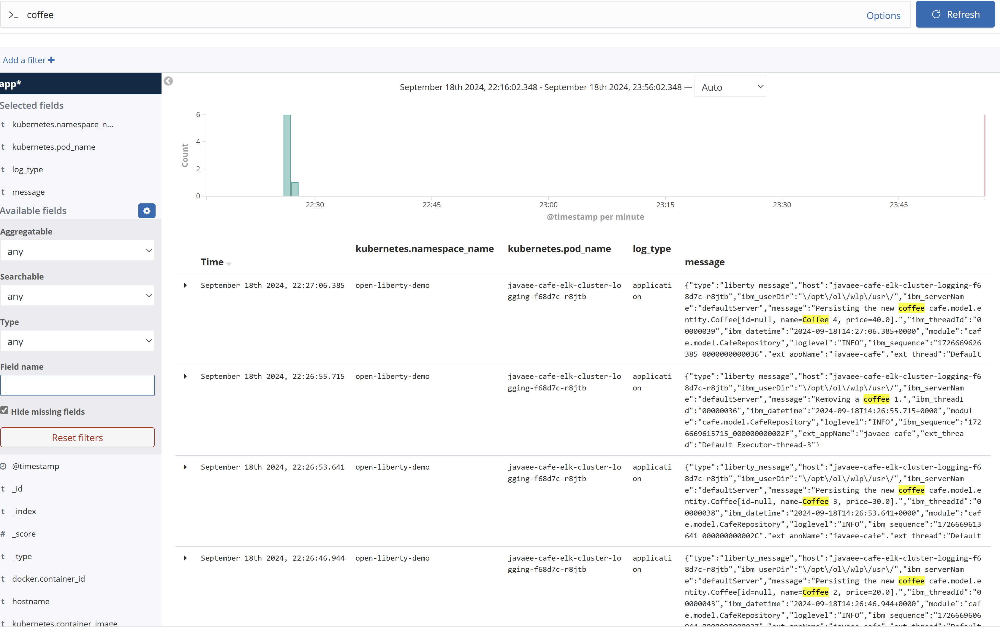

# Integrate your Liberty application with Elasticsearch stack

In this guide, you will integrate your Liberty application with Elasticsearch stack to enable distributed logging. The Liberty application is running on an Azure Red Hat OpenShift (ARO) 4 cluster. You learn how to:
> [!div class="checklist"]
>
> * Distribute your application logs to hosted Elasticsearch on Microsoft Azure
> * Distribute your application logs to EFK stack installed on ARO 4 cluster

## Before you begin

In previous guide, a Java application, which is running inside Open Liberty/WebSphere Liberty runtime, is deployed to an ARO 4 cluster. If you have not done these steps, start with [Deploy a Java application with Open Liberty/WebSphere Liberty on an Azure Red Hat OpenShift 4 cluster](howto-deploy-java-liberty-app.md) and return here to continue.

## Distribute your application logs to hosted Elasticsearch on Microsoft Azure

Elasticsearch Service on Elastic Cloud is the only hosted Elasticsearch and Kibana offering available powered by the creators. It's simple to get up and running — scale with a click, configure with a slider. Choose Microsoft Azure for your deployment and you're on your way to simple management and powerful customization. Refer to [Hosted Elasticsearch on Microsoft Azure](https://www.elastic.co/azure) for starting a free trial.

### Create a hosted Elasticsearch service on Microsoft Azure

Follow the instructions below to create a deployment for the hosted Elasticsearch service on Microsoft Azure.

1. Sign up for a [free trial](https://www.elastic.co/azure).
2. Log into [Elastic Cloud](https://cloud.elastic.co/login) using your free trial account.
3. Click **Create deployment**.
4. **Name your deployment** > Select **Azure as cloud platform** > **Leave defaults for others** or customize per your needs > Click **Create deployment**.

   
5. Wait until the deployment is created.

   
6. Write down **User name**, **Password**, and **Cloud ID** for further usage.

### Use Filebeat to retrieve and ship application logs

The application `<path-to-repo>/2-simple` used in the [previous guide](howto-deploy-java-liberty-app.md#prepare-the-liberty-application) is ready to write logs to `messages.log` file, using Java Logging API `java.util.logging`. With logging in `JSON` format is configured, Filebeat can run as a side-container to collect and ship logs from `messages.log` file to the hosted Elasticsearch service on Microsoft Azure.

To configure Filebeat as a side container to retrieve and ship application logs, a number of Kubernetes resource YAML files need to be updated or created.

| File Name             | Source Path                     | Destination Path              | Operation  | Description           |
|-----------------------|---------------------------------|-------------------------------|------------|-----------------------|  
| `filebeat-svc-account.yaml` | | [`<path-to-repo>/3-integration/elk-logging/hosted-elasticsearch/filebeat-svc-account.yaml`](https://github.com/Azure-Samples/open-liberty-on-aro/blob/master/3-integration/elk-logging/hosted-elasticsearch/filebeat-svc-account.yaml) | New | A Kubernetes **ServiceAccount** resource which is used for Filebeat container. |
| `filebeat-config.yaml` | | [`<path-to-repo>/3-integration/elk-logging/hosted-elasticsearch/filebeat-config.yaml`](https://github.com/Azure-Samples/open-liberty-on-aro/blob/master/3-integration/elk-logging/hosted-elasticsearch/filebeat-config.yaml) | New | A Kubernetes **ConfigMap** resource which is used as the Filebeat configuration file. |
| `elastic-cloud-secret.yaml` | | [`<path-to-repo>/3-integration/elk-logging/hosted-elasticsearch/elastic-cloud-secret.yaml`](https://github.com/Azure-Samples/open-liberty-on-aro/blob/master/3-integration/elk-logging/hosted-elasticsearch/elastic-cloud-secret.yaml) | New | A Kubernetes **Secret** resource with Hosted Elasticsearch service connection credentials, including `elastic.cloud.id`, and `elastic.cloud.auth`. |
| `openlibertyapplication.yaml` | [`<path-to-repo>/2-simple/openlibertyapplication.yaml`](https://github.com/Azure-Samples/open-liberty-on-aro/blob/master/2-simple/openlibertyapplication.yaml) | [`<path-to-repo>/3-integration/elk-logging/hosted-elasticsearch/openlibertyapplication.yaml`](https://github.com/Azure-Samples/open-liberty-on-aro/blob/master/3-integration/elk-logging/hosted-elasticsearch/openlibertyapplication.yaml) | Updated | Configure Filebeat as sidecar container. |

For reference, you can find these deployment files from `<path-to-repo>/3-integration/elk-logging/hosted-elasticsearch` of your local clone.

Now you can deploy the sample Liberty application to the ARO 4 cluster with the following steps.

1. Log in to the OpenShift web console from your browser using the credentials of the Azure AD user.
2. [Log in to the OpenShift CLI with the token for the Azure AD user](howto-deploy-java-liberty-app.md#log-in-to-the-openshift-cli-with-the-token).
3. Run the following commands to deploy the application.

   ```bash
   # Change directory to "<path-to-repo>/3-integration/elk-logging/hosted-elasticsearch"
   cd <path-to-repo>/3-integration/elk-logging/hosted-elasticsearch

   # Change project to "open-liberty-demo"
   oc project open-liberty-demo

   # Create ServiceAccount "filebeat-svc-account"
   oc create -f filebeat-svc-account.yaml

   # Grant the service account access to the privileged security context constraints
   oc adm policy add-scc-to-user privileged -n open-liberty-demo -z filebeat-svc-account

   # Create ConfigMap "filebeat-config"
   oc create -f filebeat-config.yaml

   # Create environment variables which will be passed to secret "elastic-cloud-secret"
   # Note: replace "<Cloud ID>", "<User name>", and "<Password>" with the ones you noted down before
   export ELASTIC_CLOUD_ID=<Cloud ID>
   export ELASTIC_CLOUD_AUTH=<User name>:<Password>

   # Create secret "elastic-cloud-secret"
   envsubst < elastic-cloud-secret.yaml | oc create -f -

   # Create OpenLibertyApplication "javaee-cafe-elk-hosted-elasticsearch"
   oc create -f openlibertyapplication.yaml

   # Check if OpenLibertyApplication instance is created
   oc get openlibertyapplication javaee-cafe-elk-hosted-elasticsearch

   # Check if deployment created by Operator is ready
   oc get deployment javaee-cafe-elk-hosted-elasticsearch

   # Get host of the route
   HOST=$(oc get route javaee-cafe-elk-hosted-elasticsearch --template='{{ .spec.host }}')
   echo "Route Host: $HOST"
   ```

Once the Liberty Application is up and running:

1. Open the output of **Route Host** in your browser to visit the application home page.
2. To generate application logs, **Create a new coffee** and **Delete an existing coffee** in the application home page.

### Visualize your application logs in Kibana

As long as the application logs are shipped to the Elasticsearch cluster, they can be visualized in the Kibana web console.

1. Log into [Elastic Cloud](https://cloud.elastic.co/login).
2. Find your deployment from **Elasticsearch Service**, click **Kibana** to open its web console.
3. From the top-left of the Kibana home page, click menu icon to expand the top-level menu items. Click **Stack Management** > **Index Patterns** > **Create index pattern**.

   
4. Set **filebeat-\*** as index pattern. Click **Next step**.

   
5. Select **@timestamp** as **Time Filter field name** > Click **Create index pattern**.
6. From the top-left of the Kibana home page, click menu icon to expand the top-level menu items. Click **Discover**. Check index pattern **filebeat-\*** is selected.
7. Add **host&#46;name**, **loglevel**, and **message** from **Available fields** into **Selected fields**. Discover application logs from the work area of the page.

   

## Distribute your application logs to EFK stack installed on ARO 4 cluster

Another option is to install EFK (Elasticsearch, Fluentd, and Kibana) stack on the ARO 4 cluster, which aggregates log data from all containers running on the cluster. The steps below describe the process of deploying EFK stack using the **Elasticsearch Operator** and the **Cluster Logging Operator**.
> [!NOTE]
> Elasticsearch is a memory-intensive application. By default, OpenShift Container Platform installs three Elasticsearch nodes with memory requests and limits of 16 GB. Specify the proper virtual machine size for the worker nodes using the `--worker-vm-size` parameter. For more information, see the following articles:
> * [Azure CLI to create a cluster](https://learn.microsoft.com/cli/azure/aro#az-aro-create)
> * [Supported virtual machine sizes for memory optimized](https://learn.microsoft.com/azure/openshift/support-policies-v4#memory-optimized)

### Deploy cluster logging

Follow the instructions in these tutorials and then return here to continue.

1. Make sure you have already signed in to the OpenShift CLI using the `kubeadmin` credentials. If not, follow [Connect using the OpenShift CLI](https://learn.microsoft.com/en-us/azure/openshift/tutorial-connect-cluster#connect-using-the-openshift-cli) to sign using `oc login` command.
1. Install the Elasticsearch Operator, Logging Operator and instance by following the steps in [Installing Logging with Elasticsearch using the web console](https://docs.openshift.com/container-platform/4.14/observability/logging/cluster-logging-deploying.html#logging-es-deploy-console_cluster-logging-deploying).
   > [!NOTE]
   > * The OpenShift version deployed in ARO 4 cluster is `4.13.40` in this guide.
   > * To specify the name of an existing **StorageClass** for Elasticsearch storage in step **Create an OpenShift Logging instance**, open **ARO web console** > **Storage** > **Storage Classes** and find the supported storage class name. For example, `managed-csi` is used in this guide.

### Deploy sample application

The application `<path-to-repo>/2-simple` used in the [previous guide](howto-deploy-java-liberty-app.md#prepare-the-liberty-application) is ready to write logs to `messages.log` file, using Java Logging API `java.util.logging`. With the **Open Liberty Operator**, which sets JSON as console log format and includes message as one of log sources, the application logs will be parsed by Fluentd and posted to Elasticsearch cluster.

To distribute your application logs to EFK stack, a number of Kubernetes resource YAML files need to be updated or created.

| File Name             | Source Path                     | Destination Path              | Operation  | Description           |
|-----------------------|---------------------------------|-------------------------------|------------|-----------------------|  
| `openlibertyapplication.yaml` | [`<path-to-repo>/2-simple/openlibertyapplication.yaml`](https://github.com/Azure-Samples/open-liberty-on-aro/blob/master/2-simple/openlibertyapplication.yaml) | [`<path-to-repo>/3-integration/elk-logging/cluster-logging/openlibertyapplication.yaml`](https://github.com/Azure-Samples/open-liberty-on-aro/blob/master/3-integration/elk-logging/cluster-logging/openlibertyapplication.yaml) | Updated | Changed name to `javaee-cafe-elk-cluster-logging`. |

For reference, you can find these deployment files from `<path-to-repo>/3-integration/elk-logging/cluster-logging` of your local clone.

Now you can deploy the sample Liberty application to the ARO 4 cluster with the following steps.

1. Make sure you have already signed in to the OpenShift CLI using the `kubeadmin` credentials. If not, follow [Connect using the OpenShift CLI](https://learn.microsoft.com/en-us/azure/openshift/tutorial-connect-cluster#connect-using-the-openshift-cli) to sign using `oc login` command.
1. Make sure you have built and pushed the Docker image of the sample application `<path-to-repo>/2-simple` to the Azure Container Registry. If not, follow the steps in [Prepare the application image](howto-deploy-java-liberty-app.md#prepare-the-application-image) to build and push the Docker image.
1. Run the following commands to deploy the application.

   ```bash
   # Change directory to "<path-to-repo>/3-integration/elk-logging/cluster-logging"
   cd <path-to-repo>/3-integration/elk-logging/cluster-logging

   # Change project to "open-liberty-demo"
   oc project open-liberty-demo

   # Create OpenLibertyApplication "javaee-cafe-elk-cluster-logging"
   oc create -f openlibertyapplication.yaml

   # Check if OpenLibertyApplication instance is created
   oc get openlibertyapplication javaee-cafe-elk-cluster-logging

   # Check if deployment created by Operator is ready
   oc get deployment javaee-cafe-elk-cluster-logging

   # Get host of the route
   HOST=$(oc get route javaee-cafe-elk-cluster-logging --template='{{ .spec.host }}')
   echo "Route Host: https://$HOST"
   ```

Once the Liberty Application is up and running:

1. Open the output of **Route Host** in your browser to visit the application home page.
2. To generate application logs, **Create a new coffee** and **Delete an existing coffee** in the application home page.

### Visualize your application logs in Kibana (EFK)

As long as the application logs are shipped to the Elasticsearch cluster, they can be visualized in the Kibana web console.

1. Log in to the OpenShift web console from your browser using the `kubeadmin` credentials. From top right toolbar, select matrix like icon > **Observability** > **Logging**. Sign in with the `kubeadmin` credentials if prompted.
1. If you signed in at the first time, select **Allow selected permissions** in **Authorize Access** page.
1. Wait until the Kibana web console is displayed.
1. Open **Management** > **Index Patterns** > Select **app\*** > **Next step ** > Select **@timestamp** > **Create index pattern**.
1. Select **Discover**. Select index pattern **app.\*** from the dropdown list.
1. Add **kubernetes.namespace_name**, **kubernetes.pod_name**, **log_type**, and **message** from **Available Fields** into **Selected Fields**. Discover application logs from the work area of the page.

   

## Next steps

In this guide, you learned how to:
> [!div class="checklist"]
>
> * Distribute your application logs to hosted Elasticsearch on Microsoft Azure
> * Distribute your application logs to EFK stack installed on ARO 4 cluster

Advance to these guides, which integrate Liberty application with other Azure services:
> [!div class="nextstepaction"]
> [Integrate your Liberty application with Azure Database for PostgreSQL](howto-integrate-azure-database-for-postgres.md)

> [!div class="nextstepaction"]
> [Integrate your Liberty application with Microsoft Entra ID OpenID Connect](howto-integrate-aad-oidc.md)

> [!div class="nextstepaction"]
> [Integrate your Liberty application with Microsoft Entra Domain Service via Secure LDAP](howto-integrate-aad-ldap.md)

If you've finished all of above guides, advance to the complete guide, which incorporates all of Azure service integrations:
> [!div class="nextstepaction"]
> [Integrate your Liberty application with different Azure services](howto-integrate-all.md)

Here are references used in this guide:

* [Hosted Elasticsearch service on Microsoft Azure](https://www.elastic.co/azure)
* [Run Filebeat on Kubernetes](https://www.elastic.co/guide/en/beats/filebeat/current/running-on-kubernetes.html)
* [Deploying cluster logging](https://docs.openshift.com/container-platform/4.3/logging/cluster-logging-deploying.html)
* [Configure Fluentd to merge JSON log message body](https://kabanero.io/guides/app-logging-ocp-4-2/#configure-fluentd-to-merge-json-log-message-body)
* [Open Liberty logging and tracing](https://www.openliberty.io/docs/ref/general/?_ga=2.160860285.1762477551.1592542266-979049641.1573374390#logging.html)
* [Open Liberty Environment Variables](https://github.com/OpenLiberty/open-liberty-operator/blob/master/doc/user-guide.adoc#open-liberty-environment-variables)
