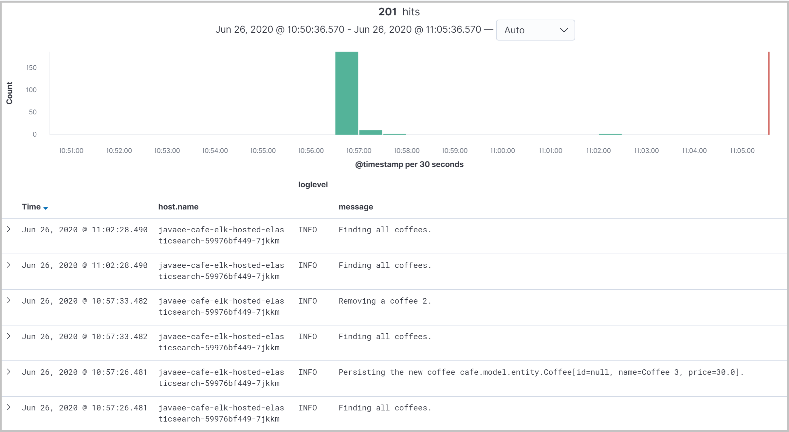

# Integrate your Open Liberty application with Elasticsearch stack

In this guide, you will integrate your Open Liberty application with Elasticsearch stack to enable distributed logging. The Open Liberty application is running on an Azure Red Hat OpenShift (ARO) 4 cluster. You learn how to:
> [!div class="checklist"]
> * Distribute your application logs to hosted Elasticsearch on Microsoft Azure
> * Distribute your application logs to EFK stack installed on ARO 4 cluster

## Before you begin

In previous guide, a Java application, which is running inside Open Liberty runtime, is deployed to an ARO 4 cluster. If you have not done these steps, start with [Deploy a Java application with Open Liberty on an Azure Red Hat OpenShift 4 cluster](howto-deploy-java-openliberty-app.md) and return here to continue.

## Distribute your application logs to hosted Elasticsearch on Microsoft Azure

Elasticsearch Service on Elastic Cloud is the only hosted Elasticsearch and Kibana offering available powered by the creators. It's simple to get up and running — scale with a click, configure with a slider. Choose Microsoft Azure for your deployment and you're on your way to simple management and powerful customization. Refer to [Hosted Elasticsearch on Microsoft Azure](https://www.elastic.co/azure) for starting a free trial.

### Create a hosted Elasticsearch service on Microsoft Azure

Follow the instructions below to create a deployment for the hosted Elasticsearch service on Microsoft Azure.

1. Sign up for a [free trial](https://www.elastic.co/azure).
2. Log into [Elastic Cloud](https://cloud.elastic.co/login) using your free trial account.
3. Click **Create deployment**.
4. **Name your deployment** > Select **Azure as cloud platform** > **Leave defaults for others** or customize per your needs > Click **Create deployment**.
   
5. Wait until the deployment is created.
   
6. Write down **User name**, **Password**, and **Cloud ID** for further usage.

### Use Filebeat to retrieve and ship application logs

The application `<path-to-repo>/2-simple` used in the [previous guide](howto-deploy-java-openliberty-app.md) is ready to write logs to `messages.log` file, using Java Logging API `java.util.logging`. With logging in `JSON` format is configured, Filebeat can run as a side-container to collect and ship logs from `messages.log` file to the hosted Elasticsearch service on Microsoft Azure.

Follow the steps below to configure Filebeat as a side container to retrieve and ship application logs.

#### Configure Filebeat

You need to create a service account, which is required by Filebeat container. Here is the YAML file for you located at `<path-to-repo>/3-integration/elk-logging/hosted-elasticsearch/filebeat-svc-account.yaml`.

```yaml
apiVersion: v1
kind: ServiceAccount
metadata:
  name: filebeat-svc-account
  namespace: open-liberty-demo
```

1. Change directory to `<path-to-repo>/3-integration/elk-logging/hosted-elasticsearch`.
2. Change project to **open-liberty-demo**:

   ```bash
   oc project open-liberty-demo
   ````

   > [!NOTE]
   > * Refer to [Set up Azure Red Hat OpenShift cluster](howto-deploy-java-openliberty-app.md#set-up-azure-red-hat-openshift-cluster) on how to connect to the cluster.
   > * **open-liberty-demo** is already created in the [previous guide](howto-deploy-java-openliberty-app.md).

3. Create service account:

   ```bash
   oc create -f ./filebeat-svc-account.yaml
   ```

4. Grant the Filebeat service account access to the privileged security context constraints (SCC):

   ```bash
   oc adm policy add-scc-to-user privileged -n open-liberty-demo -z filebeat-svc-account
   ```

Then create a **ConfigMap** for Filebeat configuration, using the YAML file located at `<path-to-repo>/3-integration/elk-logging/hosted-elasticsearch/filebeat-config.yaml`.

```yaml
apiVersion: v1
kind: ConfigMap
metadata:
  name: filebeat-config
  namespace: open-liberty-demo
data:
  filebeat.yml: |-
    filebeat.inputs:
    - type: log
      paths:
        - /logs/messages*.log
      json.message_key: ibm_datetime
      json.keys_under_root: true
      json.add_error_key: true
    cloud.id: ${ELASTIC_CLOUD_ID}
    cloud.auth: ${ELASTIC_CLOUD_AUTH}
```

1. Create **ConfigMap**:

   ```bash
   oc create -f ./filebeat-config.yaml
   ```

#### Create secret for hosted Elasticsearch service authentication

Next, create a **Secret** with the authentication credentials of the hosted Elasticsearch service, using the YAML file located at `<path-to-repo>/3-integration/elk-logging/hosted-elasticsearch/elastic-cloud-secret.yaml`.

```yaml
apiVersion: v1
kind: Secret
metadata:
  name: elastic-cloud-secret
  namespace: open-liberty-demo
type: Opaque
stringData:
  elastic.cloud.id: ${ELASTIC_CLOUD_ID}
  elastic.cloud.auth: ${ELASTIC_CLOUD_AUTH}
```

> [!NOTE]
> * Replace **${ELASTIC_CLOUD_ID}** with **Cloud ID** you wrote down before.
> * Replace **${ELASTIC_CLOUD_AUTH}** with **User name:Password** you wrote down before.

1. Create **Secret**:

   ```bash
   oc create -f ./elastic-cloud-secret.yaml
   ```

#### Deploy application with Filebeat as a side-container

Now we can deploy the sample Open Liberty Application with Filebeat as a side-container to collect and ship application logs, using the YAML file located at `<path-to-repo>/3-integration/elk-logging/hosted-elasticsearch/openlibertyapplication.yaml`.

```yaml
apiVersion: openliberty.io/v1beta1
kind: OpenLibertyApplication
metadata:
  name: javaee-cafe-elk-hosted-elasticsearch
  namespace: open-liberty-demo
spec:
  replicas: 1
  # Note: replace "${Your_DockerHub_Account}" with your Docker Hub account name
  applicationImage: docker.io/${Your_DockerHub_Account}/javaee-cafe-simple:1.0.0
  expose: true
  serviceAccountName: filebeat-svc-account
  env:
  - name: WLP_LOGGING_MESSAGE_FORMAT
    value: JSON
  - name: WLP_LOGGING_MESSAGE_SOURCE
    value: message,trace,accessLog,ffdc,audit
  volumeMounts:
  - name: logs-volume
    mountPath: /logs
  volumes:
  - name: logs-volume
    emptyDir: {}
  - name: config
    configMap:
      defaultMode: 0600
      name: filebeat-config
  sidecarContainers:
  - name: filebeat
    image: docker.elastic.co/beats/filebeat:7.6.2
    args: [
      "-c", "/etc/filebeat.yml",
      "-e",
    ]
    securityContext:
      runAsUser: 0
      privileged: true
    env:
    - name: ELASTIC_CLOUD_ID
      valueFrom:
        secretKeyRef:
          name: elastic-cloud-secret
          key: elastic.cloud.id
    - name: ELASTIC_CLOUD_AUTH
      valueFrom:
        secretKeyRef:
          name: elastic-cloud-secret
          key: elastic.cloud.auth
    volumeMounts:
    - name: config
      mountPath: /etc/filebeat.yml
      readOnly: true
      subPath: filebeat.yml
    - name: logs-volume
      mountPath: /logs
      readOnly: true
```

> [!NOTE]
> * Replace **${Your_DockerHub_Account}** with your Docker Hub account name.
> * Image `javaee-cafe-simple` is built from [previous guide](howto-deploy-java-openliberty-app.md#build-application-image).

1. Run the following commands to deploy your Open Liberty Application:

   ```bash
   # Create OpenLibertyApplication custom resource
   oc create -f ./openlibertyapplication.yaml

   # Check if OpenLibertyApplication instance is created
   oc get openlibertyapplication

   # Check if deployment created by Operator is ready
   oc get deployment

   # Check if route is created by Operator
   oc get route
   ```

2. Once the Open Liberty Application is up and running, open **HOST/PORT** of the route in your browser to visit the application home page.
3. To generate application logs, **Create a new coffee** and **Delete an existing coffee** in the application home page.

For reference, you can find these deployment files from `<path-to-repo>/3-integration/elk-logging/hosted-elasticsearch` of your local clone.

### Visualize your application logs in Kibana

As long as the application logs are shipped to the Elasticsearch cluster, they can be visualized in the Kinaba web console.

1. Log into [Elastic Cloud](https://cloud.elastic.co/login).
2. Find your deployment from **Elasticsearch Service**, click **Kibana** to open its web console.
3. From the top-left of the home page, click menu icon to expand the top-level menu items. Click **Stack Management** > **Index Patterns** > **Create index pattern**.
   
4. Set **filebeat-\*** as index pattern. Click **Next step**.
   
5. Select **@timestamp** as **Time Filter field name** > Click **Create index pattern**.
6. From the top-left of the home page, click menu icon to expand the top-level menu items. Click **Discover**. Check index pattern **filebeat-\*** is selected.
7. Add **host&#46;name**, **loglevel**, and **message** from **Available fields** into **Selected fields**. Discover application logs from the work area of the page.
   

## Distribute your application logs to EFK stack installed on ARO 4 cluster

Another option is to install EFK (Elasticsearch, Fluentd, and Kibana) stack on the ARO 4 cluster, which aggregates log data from all containers running on the cluster. The steps below describe the process of deploying EFK stack using the **Elasticsearch Operator** and the **Cluster Logging Operator**.
> [!NOTE]
> Elasticsearch is a memory-intensive application. Refer to section [Set up Azure Red Hat OpenShift cluster](howto-deploy-java-openliberty-app.md#set-up-azure-red-hat-openshift-cluster) from the previous guide to learn how to specify appropriate virtual machine size for the worker nodes when creating the cluster.

### Deploy cluster logging

Follow the instructions in these tutorials and then return here to continue.

1. [Connect to the cluster](https://docs.microsoft.com/azure/openshift/tutorial-connect-cluster).
2. Install the Elasticsearch Operator by following the steps in [Install the Elasticsearch Operator using the CLI](https://docs.openshift.com/container-platform/4.3/logging/cluster-logging-deploying.html#cluster-logging-deploy-eo-cli_cluster-logging-deploying).
3. Install the Cluster Logging Operator by following the steps in [Install the Cluster Logging Operator using the CLI](https://docs.openshift.com/container-platform/4.3/logging/cluster-logging-deploying.html#cluster-logging-deploy-clo-cli_cluster-logging-deploying).

> [!NOTE]
> To specify the name of an existing **StorageClass** for Elasticsearch storage in step **Create a Cluster Logging instance**, open **ARO web console** > **Storage** > **Storage Classes** and find the supported storage class name.

After the newly created Cluster Logging instance is up and running, configure Fluentd to merge JSON log message body emitted by sample application.

1. Switch to project `openshift-logging`:

   ```bash
   oc project openshift-logging
   ```

2. Change the cluster logging instance’s **managementState** field from **Managed** to **Unmanaged**:

   ```bash
   oc edit ClusterLogging instance
   ```

3. Set the environment variable **MERGE_JSON_LOG** to **true**:

   ```bash
   oc set env ds/fluentd MERGE_JSON_LOG=true
   ```

### Deploy sample application

The application `<path-to-repo>/2-simple` used in the [previous guide](howto-deploy-java-openliberty-app.md) is ready to write logs to `messages.log` file, using Java Logging API `java.util.logging`. With the **Open Liberty Operator**, which sets JSON as console log format and includes message as one of log sources, the application logs will be parsed by Fluentd and posted to Elasticsearch cluster.

Now we can deploy the sample Open Liberty Application, using the YAML file located at `<path-to-repo>/3-integration/elk-logging/cluster-logging/openlibertyapplication.yaml`.

```yaml
apiVersion: openliberty.io/v1beta1
kind: OpenLibertyApplication
metadata:
  name: javaee-cafe-elk-cluster-logging
  namespace: open-liberty-demo
spec:
  replicas: 1
  # Note: replace "${Your_DockerHub_Account}" with your Docker Hub account name
  applicationImage: docker.io/${Your_DockerHub_Account}/javaee-cafe-simple:1.0.0
  expose: true
```

> [!NOTE]
> * Replace **${Your_DockerHub_Account}** with your Docker Hub account name.
> * Image `javaee-cafe-simple` is built from [previous guide](howto-deploy-java-openliberty-app.md#build-application-image).

1. Change directory to `<path-to-repo>/3-integration/elk-logging/cluster-logging`.
2. Run the following commands to deploy your Open Liberty Application:

   ```bash
   # Change project to "open-liberty-demo"
   oc project open-liberty-demo

   # Create OpenLibertyApplication custom resource
   oc create -f ./openlibertyapplication.yaml

   # Check if OpenLibertyApplication instance is created
   oc get openlibertyapplication

   # Check if deployment created by Operator is ready
   oc get deployment

   # Check if route is created by Operator
   oc get route
   ```

3. Once the Open Liberty Application is up and running, open **HOST/PORT** of the route in your browser to visit the application home page.
4. To generate application logs, **Create a new coffee** and **Delete an existing coffee** in the application home page.

For reference, you can find these deployment files from `<path-to-repo>/3-integration/elk-logging/cluster-logging` of your local clone.

### Visualize your application logs in Kibana (EFK)

As long as the application logs are shipped to the Elasticsearch cluster, they can be visualized in the Kinaba web console.

1. Log into ARO web console. Click **Monitoring** > **Logging**.
2. In the new opened window, click **Log in with OpenShift**. Log in with user **kubeadmin**.
3. Open **Management** > **Index Patterns** > Select **project.\*** > Click **Refresh field list** icon at top-right of the page.
   
4. Click **Discover**. Select index pattern **project.\*** from the dropdown list.
5. Add **kubernetes.namespace_name**, **kubernetes.pod_name**, **loglevel**, and **message** from **Available Fields** into **Selected Fields**. Discover application logs from the work area of the page.
   

## Next steps

In this guide, you learned how to:
> [!div class="checklist"]
> * Distribute your application logs to hosted Elasticsearch on Microsoft Azure
> * Distribute your application logs to EFK stack installed on ARO 4 cluster

Advance to these guides, which integrate Open Liberty application with other Azure services:
> [!div class="nextstepaction"]
> [Integrate your Open Liberty application with Azure Active Directory OpenID Connect](howto-integrate-aad-oidc.md)

> [!div class="nextstepaction"]
> [Integrate your Open Liberty application with Azure managed databases](howto-integrate-azure-managed-databases.md)

If you've finished all of above guides, advance to the complete guide, which incorporates all of Azure service integrations:
> [!div class="nextstepaction"]
> [Integrate your Open Liberty application with different Azure services](howto-integrate-all.md)

Here are references used in this guide:

* [Hosted Elasticsearch service on Microsoft Azure](https://www.elastic.co/azure)
* [Run Filebeat on Kubernetes](https://www.elastic.co/guide/en/beats/filebeat/current/running-on-kubernetes.html)
* [Deploying cluster logging](https://docs.openshift.com/container-platform/4.3/logging/cluster-logging-deploying.html)
* [Configure Fluentd to merge JSON log message body](https://kabanero.io/guides/app-logging-ocp-4-2/#configure-fluentd-to-merge-json-log-message-body)
* [Open Liberty logging and tracing](https://www.openliberty.io/docs/ref/general/?_ga=2.160860285.1762477551.1592542266-979049641.1573374390#logging.html)
* [Open Liberty Environment Variables](https://github.com/OpenLiberty/open-liberty-operator/blob/master/doc/user-guide.adoc#open-liberty-environment-variables)
