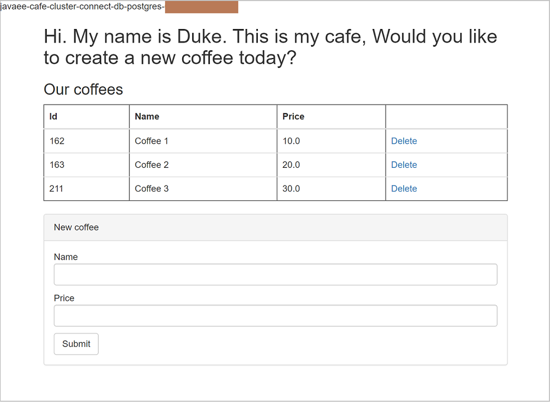

# Set up your Liberty application in a multi-node stateless cluster with load balancing

When traffic increases, you will need to scale the Liberty application to keep up with user demand. Kubernetes natively supports scaling out the application deployment by changing the number of replicas. In this guide, you will run multiple instances of your Liberty application on an Azure Red Hat OpenShift (ARO) 4 cluster. You learn how to:
> [!div class="checklist"]
>
> * Deploy Liberty application in a multi-node stateless cluster

## Before you begin

In previous guide, a stateless Java application, which is running inside Open Liberty/WebSphere Liberty runtime and connects to an Azure managed database, is deployed to an ARO 4 cluster. If you have not done these steps, start with [Integrate your Liberty application with Azure managed databases](howto-integrate-azure-managed-databases.md) and return here to continue.

## Deploy sample application in a multi-node stateless cluster

To run the multiple instances of your Liberty application, a number of Kubernetes resource YAML files need to be updated or created:

| File Name             | Source Path                     | Destination Path              | Operation  | Description           |
|-----------------------|---------------------------------|-------------------------------|------------|-----------------------|  
| `openlibertyapplication-cluster.yaml` | [`<path-to-repo>/3-integration/connect-db/openlibertyapplication.yaml`](https://github.com/Azure-Samples/open-liberty-on-aro/blob/master/3-integration/connect-db/openlibertyapplication.yaml) | [`<path-to-repo>/3-integration/connect-db/openlibertyapplication-cluster.yaml`](https://github.com/Azure-Samples/open-liberty-on-aro/blob/master/3-integration/connect-db/openlibertyapplication-cluster.yaml) | Updated | Accept the value of environment variable `REPLICAS` as number of pods to be created. Set environment variable `SHOW_HOST_NAME` to `true` so pod name is displayed on the page. |

For reference, these changes have already been applied in `<path-to-repo>/3-integration/connect-db/openlibertyapplication-cluster.yaml` of your local clone.

Now you can deploy the sample Liberty application to the ARO 4 cluster with the following steps.

1. Log in to the OpenShift web console from your browser using the credentials of the Azure AD user.
2. [Log in to the OpenShift CLI with the token for the Azure AD user](howto-deploy-java-liberty-app.md#log-in-to-the-openshift-cli-with-the-token).
3. Run the following commands to deploy the application.

   ```bash
   # Change directory to "<path-to-repo>/3-integration/connect-db"
   cd <path-to-repo>/3-integration/connect-db

   # Change project to "open-liberty-demo"
   oc project open-liberty-demo

   # Note:
   # - replace "<DB_Type>" with "mssql" for testing DB connection with Azure SQL
   # - replace "<DB_Type>" with "postgres" for testing DB connection with Azure Database for PostgreSQL
   export DB_Type=<DB_Type>

   # Note:
   # - replace "<Image_Name>" with "javaee-cafe-connect-db-mssql" for testing DB connection with Azure SQL
   # - replace "<Image_Name>" with "javaee-cafe-connect-db-postgres" for testing DB connection with Azure Database for PostgreSQL
   export Image_Name=<Image_Name>

   # Note: you can also specify a different number (>1) here, which is the number of pods to be created
   export REPLICAS=3

   # Create OpenLibertyApplication "javaee-cafe-cluster-connect-db-${DB_Type}"
   envsubst < openlibertyapplication-cluster.yaml | oc create -f -

   # Check if OpenLibertyApplication instance is created
   oc get openlibertyapplication javaee-cafe-cluster-connect-db-${DB_Type}

   # Check if deployment created by Operator is ready
   oc get deployment javaee-cafe-cluster-connect-db-${DB_Type}

   # Get host of the route
   HOST=$(oc get route javaee-cafe-cluster-connect-db-${DB_Type} --template='{{ .spec.host }}')
   echo "Route Host: $HOST"
   ```

Once the Liberty Application is up and running:

1. Open the output of **Route Host** in your browser to visit the application home page, where the pod name is displayed.

   
2. Update the list of coffees by creating a new coffee and deleting an existing coffee.
3. Open the application home page in the private window of the browser or another different browser. Close the browser window if the pod name displayed is same as the previous one.
4. Repeat step 3 until you observe a different pod name is displayed. The same list of coffees should be observed.

## Next steps

In this guide, you learned how to:
> [!div class="checklist"]
>
> * Deploy Liberty application in a multi-node stateless cluster

Advance to these guides, which integrate Liberty application with other Azure services:
> [!div class="nextstepaction"]
> [Integrate your Liberty application with Elasticsearch stack](howto-integrate-elasticsearch-stack.md)

> [!div class="nextstepaction"]
> [Integrate your Liberty application with Azure Active Directory OpenID Connect](howto-integrate-aad-oidc.md)

> [!div class="nextstepaction"]
> [Integrate your Liberty application with Azure Active Directory Domain Service via Secure LDAP](howto-integrate-aad-ldap.md)

If you've finished all of above guides, advance to the complete guide, which incorporates all of Azure service integrations:
> [!div class="nextstepaction"]
> [Integrate your Liberty application with different Azure services](howto-integrate-all.md)

Here are references used in this guide:

* [Running Multiple Instances of Your App](https://kubernetes.io/docs/tutorials/kubernetes-basics/scale/scale-intro/)
